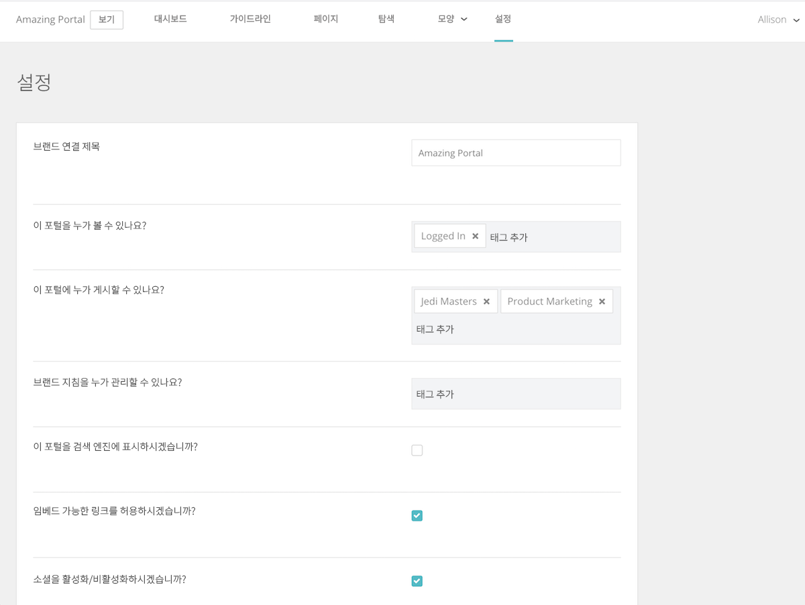

# [!UICONTROL Brand Connect] 시스템 설정 구성

[!UICONTROL Brand Connect] 설정은 포털을 볼 수 있는 사용자, 포털에 콘텐츠를 게시할 수 있는 사용자, 브랜드 지침을 관리할 수 있는 사용자를 제어합니다.

설정에 액세스하려면 [!UICONTROL Workfront DAM]에 로그인합니다.

1. 탐색 막대의 **설정 아이콘**&#x200B;을 클릭하고 **[!UICONTROL Brand Connect]**&#x200B;를 선택합니다. 또는 탐색 막대의 **[!UICONTROL 브랜드]**&#x200B;를 클릭합니다.
1. 그런 다음 [!UICONTROL Brand Connect] 패널의 오른쪽 상단에 있는 **[!UICONTROL 편집]** 옵션을 클릭합니다. 조직에 여러 [!UICONTROL Brand Connects]가 있는 경우, 올바른 항목을 편집하고 있는지 확인하십시오.

이러한 설정에 대해 질문이 있는 경우 [!UICONTROL Workfront] 컨설턴트에게 문의하십시오.

* **[!UICONTROL Brand Connect] 제목**- [!UICONTROL Brand Connect]의 이름을 지정합니다(또는 이름 변경).
* **이 포털을 볼 수 있는 사용자**—[!UICONTROL Brand Connect를 볼 수 있는 그룹을 설정합니다]. 예를 들어 [!UICONTROL 로그인됨] 그룹을 추가하면 로그인한 모든 사용자가 포털을 볼 수 있습니다. 단, 폴더 권한은 여전히 적용되므로 사용자가 포털을 볼 수 있어도 [!UICONTROL 로그인됨] 그룹에 폴더에 대한 권한이 부여되지 않는 한 자산에 액세스할 수 없습니다.
* **이 포털에 게시할 수 있는 사용자는 누구입니까?**—자산을 [!UICONTROL Brand Connect]에 게시할 수 있는 그룹을 설정하십시오. 참여자 그룹이 됩니다. 액세스 권한이 있는 항목만 게시할 수 있습니다.
* **브랜드 지침을 관리할 수 있는 사용자는 누구입니까?**—브랜드 지침을 관리할 수 있는 그룹을 설정합니다. 지침 관리는 관리자에게만 제한되지 않습니다. 지침을 편집할 참여자 그룹을 설정할 수 있습니다.
* **검색 엔진에 이 포털을 표시하시겠습니까?**—사람들이 인터넷에서 검색을 실행할 때 [!UICONTROL Brand Connect] URL을 표시하시겠습니까?
* **포함 가능한 링크를 허용하시겠습니까?**—포함 가능한 링크가 [!UICONTROL Brand Connect]에서 제공될 수 있습니까? 자산에 임베드 가능한 링크를 제공하는 [!UICONTROL 공유] 메뉴에 [!UICONTROL 링크 가져오기] 패널이 추가됩니다.
* **Social을 사용/사용하지 않도록 설정하시겠습니까?**—Social이 사용하도록 설정된 경우(확인란 선택), 사용자는 에셋에 대해 좋아하거나 댓글을 달 수 있습니다.
* **다운로드 및 보기 횟수를 활성화/비활성화하시겠습니까?**—활성화되면 사용자는 에셋이 다운로드된 횟수와 에셋에 포함된 댓글을 확인할 수 있습니다.
* **처음에 패싯 숨기기**- [!UICONTROL 자산] 페이지의 왼쪽 패널에 표시되는 메타데이터 검색 필더를 숨깁니다.
* **라이트박스 레이블**- [!UICONTROL 라이트박스] ([!UICONTROL 라이트박스], [!UICONTROL 컬렉션], [!UICONTROL 즐겨찾기] 또는 [!UICONTROL 즐겨찾기])에 대한 레이블을 선택합니다.
