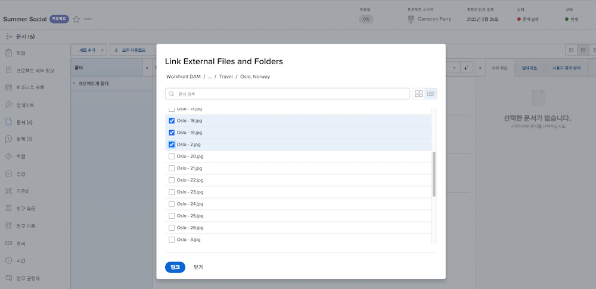

# 추가 [!UICONTROL Workfront DAM] 링크 위치 [!DNL Workfront]

먼저 두 시스템 간의 연결을 설정합니다.

1. 에 로그인합니다. [!DNL Workfront].
1. 프로젝트, 작업 또는 문제를 열고 **[!UICONTROL 문서]** 탭.
1. 을(를) 클릭합니다. **[!UICONTROL 새로 추가]** 단추를 누르고 선택합니다. **[!UICONTROL Workfront DAM에서]** 를 클릭합니다.
1. 로그인 이름과 암호를 [!UICONTROL Workfront DAM] 인증 상자가 나타납니다.
1. 다음을 클릭합니다. **[!UICONTROL 예]** : [!DNL Workfront] 액세스 권한 [!UICONTROL DAM] 계정이 필요합니다.
1. 필요한 경우 페이지를 새로 고쳐 액세스를 업데이트합니다 [!UICONTROL Workfront DAM].

이제 [!UICONTROL Workfront DAM] 항목 [!DNL Workfront].

1. 에 로그인합니다. [!DNL Workfront].
1. 프로젝트, 작업 또는 문제를 열고 **[!UICONTROL 문서]** 탭.
1. 을(를) 클릭합니다. **[!UICONTROL 새로 추가]** 단추를 누르고 선택합니다. **[!UICONTROL Workfront DAM에서]** 를 클릭합니다.
   ![의 이미지 [!UICONTROL Workfront DAM에서] 옵션 [!UICONTROL 새로 추가] 드롭다운 메뉴](assets/01-contributor-from-workfront-dam.png)
1. 에 액세스할 수 있는 파일 및 폴더 목록입니다 [!UICONTROL Workfront DAM] 창에 나타납니다.

1. 찾고 있는 자산을 찾아 옆에 있는 상자를 선택합니다. 기본 보기는 목록이지만 창의 오른쪽 위 모서리에 있는 아이콘을 사용하여 축소판 보기로 전환할 수 있습니다.

   

1. 을(를) 클릭합니다. **[!UICONTROL 링크]** 버튼을 클릭합니다. 링크 [!UICONTROL Workfront DAM] 파일이 문서 목록에 나타납니다. 아이콘은 이 링크를 나타냅니다.

   ![에 연결된 링크의 이미지 [!UICONTROL Workfront DAM] 문서 목록에 나타나는 파일 [!DNL Workfront].](assets/03-contributor-linked-in-wf.png)
