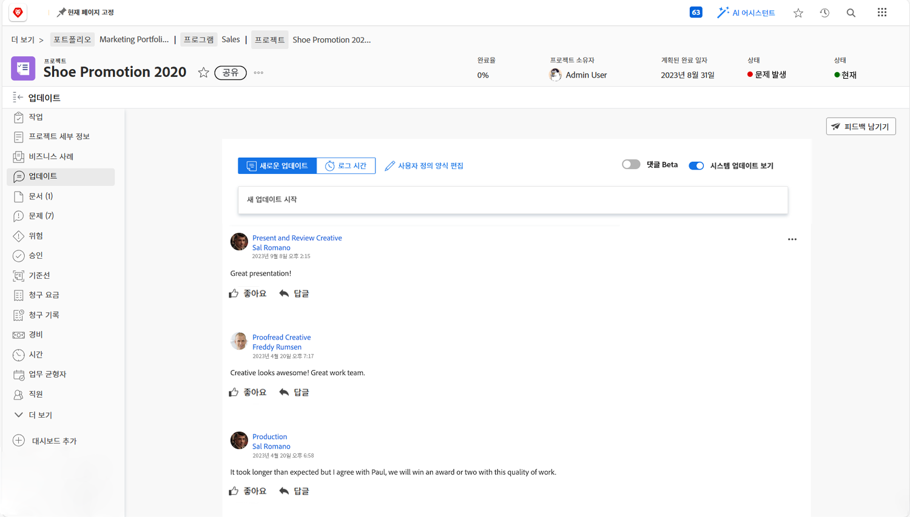
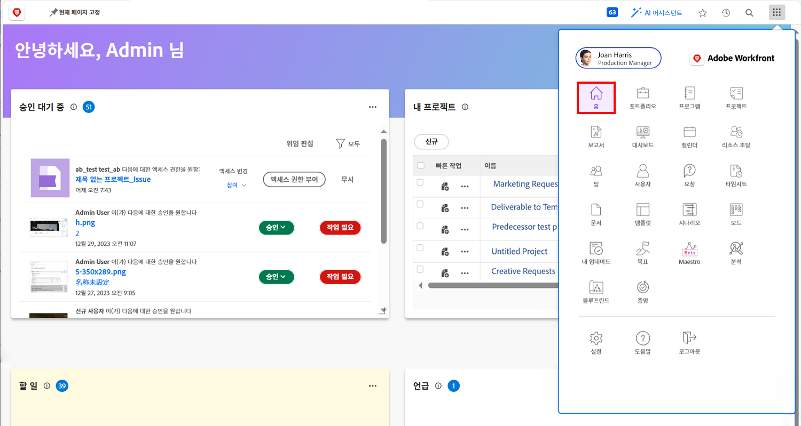

# 경영진을 위한 Workfront

Workfront이 조직의 작업을 관리하는 데 어떻게 도움이 되는지 알아봅니다.

Adobe Workfront은 경영진으로서 다음과 같은 작업을 수행할 수 있습니다.

* 계속 귀하가 우려하는 작업의 진행 상황을 알려주십시오. **보고서 및 대시보드**
* 쉬운 방법 제공 **업데이트를 사용하여 프로젝트 이해 당사자와 의사 소통**
* 쉬운 방법 제공 **작업 요청 만들기**
* 쉽게 볼 수 있는 방법 제공 **승인 대기 중인 항목**

## 보고서와 대시보드

### 보고서

Workfront의 보고서는 더 나은 결정을 더 빨리 내리는 데 있어 중추입니다. 프로젝트 영역, 사람 영역, 작업 랜딩 페이지 등 어디에서나 볼 수 있습니다.

리더와 경영진은 보고서 영역으로 이동하여 특정 정보가 포함된 사용자 정의 보고서를 볼 수 있습니다. 가장 중요한 보고서에 대한 가시성을 높이기 위해 Workfront은 대시보드를 사용합니다.

### 대시보드

리더는 대시보드를 사용하여 조직이 현재 작업 중인 작업의 모든 부분을 보고 신속하게 드릴다운할 수 있습니다. 대시보드는 리더가 정기적으로 확인해야 하는 정보를 제공하는 보고서 모음입니다. 대시보드는 사용자가 완전히 맞춤화할 수 있으므로 Workfront을 사용하는 모든 사용자가 자신에게 중요한 작업을 볼 수 있습니다.

오른쪽 상단의 기본 메뉴 아이콘에서 대시보드 를 클릭하여 대시보드 영역에 액세스합니다.

리더는 왼쪽 패널 탐색에서 사용할 수 있는 다양한 대시보드에 액세스할 수 있습니다.

* **모든 대시보드**: 사용자 또는 다른 사용자가 만들고 적어도 볼 수 있는 권한이 있는 대시보드를 표시합니다.
* **내 대시보드**: 사용자가 빌드한 대시보드를 표시합니다.
* **공유 대시보드**: 다른 사용자가 만들고 사용자와 공유한 대시보드를 표시합니다.

리더는 대시보드를 통해 팀이 다루는 중요한 프로젝트와 미해결 문제에 대해 &quot;비용, 수익 및 예산&quot;과 같은 사항을 검토할 수 있습니다. 경영진의 승인이 필요한 항목 목록과 함께 위험 상태의 프로젝트도 볼 수 있습니다.

Workfront의 보고서를 통해 직원의 책임을 완수할 수 있습니다. 보고서 활용의 핵심은 조직에서 보고서를 사용하는 방식에 대한 명확한 워크플로우를 구축하는 것입니다. 모든 사람이 성공을 측정하는 데 사용되는 보고서를 명확하게 이해해야 합니다.

Workfront의 대시보드에 있는 보고서의 예

## 업데이트를 사용하여 프로젝트 이해 당사자와 의사 소통

모든 프로젝트 커뮤니케이션에 쉽게 액세스할 수 있도록 프로젝트 자체 내에서 프로젝트 팀과 커뮤니케이션합니다.

## 요청

많은 조직에서 새 프로젝트를 시작하거나, 새 제품을 개발하거나, 결과물을 만드는 첫 번째 단계는 Workfront에서 요청을 하는 것입니다. 요청에 대한 진행 상황을 추적하고 필요한 경우 추가 정보를 제공할 수 있습니다.

이 비디오에서는 다음 방법을 알아봅니다.

* 요청 영역으로 이동합니다.
* 요청
* 제출된 요청 보기

>[!VIDEO](https://video.tv.adobe.com/v/336092/?quality=12&learn=on)

## 승인 대기 중인 항목

위치 [!UICONTROL 홈] 승인 대기 중인 항목을 쉽게 찾을 수 있습니다.

