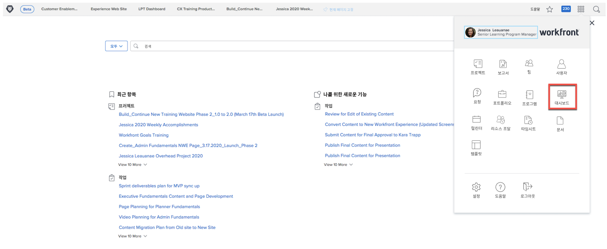

# Workfront for executive

## 보고서와 대시보드

### 보고서

Workfront의 보고서는 더 나은 결정을 빠르고 신속하게 내리는 중요한 요소입니다. 프로젝트 영역, 사람 영역 또는 작업 랜딩 페이지의 어디를 가든 볼 수 있습니다.

리더 및 경영진이 보고서 영역으로 이동하여 특정 정보로 사용자 지정 보고서를 볼 수 있습니다. Workfront은 가장 중요한 보고서에 대한 가시성을 높이기 위해 대시보드를 사용합니다.

### 대시보드

대시보드를 사용하면 리더는 해당 조직이 현재 작업 중인 작업의 모든 부분을 보고 빠르게 드릴다운할 수 있습니다.대시보드는 정보 리더를 정기적으로 봐야 할 수 있는 보고서 모음입니다. 대시보드는 Workfront을 사용하는 모든 사용자가 대시보드에 중요한 작업을 볼 수 있도록 완전히 사용자 지정할 수 있습니다.

오른쪽 상단 모서리의 기본 메뉴 아이콘에서 대시보드 를 클릭하여 대시보드 영역에 액세스합니다.

리더는 왼쪽 패널 탐색에서 사용할 수 있는 다양한 대시보드에 액세스할 수 있습니다.

* **모든 대시보드**: 사용자나 다른 사용자가 만든 대시보드와 최소 보기에 대한 권한이 있는 대시보드를 표시합니다.
* **내 대시보드**: 작성한 대시보드를 표시합니다.
* **공유 대시보드**: 다른 사용자가 만들고 사용자와 공유한 대시보드를 표시합니다.

대시보드를 통해 리더는 중요한 프로젝트와 해당 팀이 다루고 있는 개방형 문제에 대해 &quot;비용, 수익 및 예산&quot;과 같은 사항을 검토할 수 있습니다. 또한 위험에 처한 프로젝트와 경영진 승인이 필요한 항목 목록을 볼 수 있습니다.

Workfront의 보고서는 직원의 책임을 높이는 데 도움이 될 수 있습니다. 보고서를 활용하는 키는 조직이 보고서를 사용하는 방식에 대해 명확한 워크플로우를 구축하는 것입니다. 모든 사람이 성공을 측정하는 데 사용되는 보고서를 명확하게 이해하도록 하십시오.

Workfront의 대시보드에 있는 보고서의 예

## 요청 수행

많은 조직에서 새로운 프로젝트를 시작하거나 새 제품을 만들거나 결과물을 만드는 첫 번째 단계가 Workfront에서 요청을 하고 있습니다. 요청에 대한 진행 상황을 추적하고 필요한 경우 추가 정보를 제공할 수 있습니다.

이 비디오에서는 다음 방법을 배웁니다.

* 요청 영역으로 이동합니다
* 요청 수행
* 제출된 요청 보기

>[!VIDEO](https://video.tv.adobe.com/v/336092/?quality=12)
