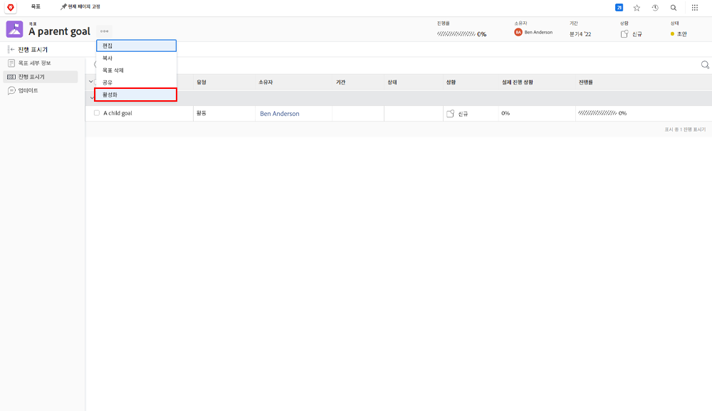

# 에서 목표를 다른 목표에 정렬하여 활성화 [!DNL Workfront Goals]

두 목표를 맞추면 하나는 상위 목표가 되고 다른 하나는 하위 목표가 됩니다. 상위 목표에는 여러 개의 하위 목표가 있을 수 있지만 하위 목표는 하나의 상위 목표에만 맞출 수 있습니다.

1. 하위 목표에 있는 이름을 클릭하여 하위 목표를 엽니다 [!UICONTROL 목표 목록]. 기본적으로 [!UICONTROL 목표 세부 사항] 탭.
1. 을(를) 클릭합니다. [!UICONTROL +추가] 단추 [!UICONTROL 상위 목표 정보] 패널.

   ![의 스크린샷 [!UICONTROL 목표 세부 사항] 탭](assets/06-workfront-goals-align-goals.png)

1. 에서 원하는 상위 목표의 이름을 입력합니다 [!UICONTROL 상위 목표] 필드를 선택한 다음 목록에 표시될 때 선택합니다. 동일한 기간 또는 미래 기간의 목표만 목록에 표시됩니다.

   ![의 스크린샷 [!UICONTROL 목표 세부 사항] 패널을 보여 주는 패널 [!UICONTROL 상위 목표 정보] 패널](assets/07-workfront-goals-align-to.png)

1. 클릭 [!UICONTROL 변경 내용 저장].

목표를 다른 목표에 정렬하면 하위 목표가 만들어집니다. 하위 목표를 조직 또는 팀의 상위 목표에 기여하는 개별 목표로서 생각하십시오. 하위 목표는 상위 목표의 진행 상황을 활성화하고 영향을 줄 수 있습니다.

## 이제 상위 목표를 활성화합니다

하위 목표를 만들었으므로 이제 상위 목표에 대한 진행률 표시기가 됩니다. 상위 목표 이름 옆에 있는 세 개의 점 메뉴를 클릭하면 활성화 옵션이 표시됩니다.

