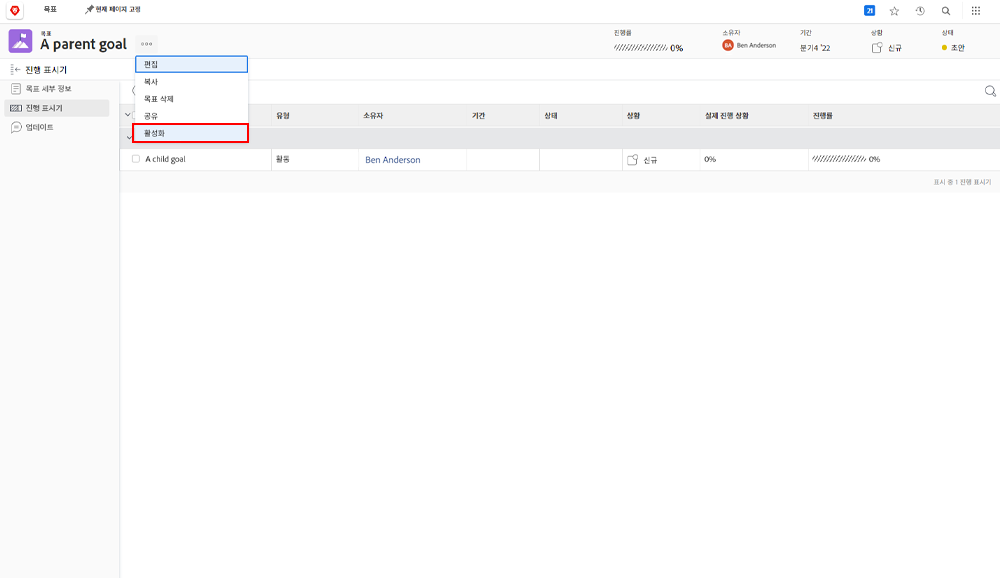

# 다른 목표에 맞추어 목표 활성화

두 목표를 맞추면 하나는 상위 목표가 되고 다른 하나는 하위 목표가 됩니다. 상위 목표에는 여러 하위 목표가 있을 수 있지만, 하위 목표는 하나의 상위 목표에만 맞출 수 있습니다.

1. [!UICONTROL 목표 목록]의 해당 이름을 클릭하여 하위 목표를 엽니다. 기본적으로 [!UICONTROL 목표 세부 정보] 탭에 사용자가 표시됩니다.
1. [!UICONTROL 상위 목표 정보] 패널의 [!UICONTROL +추가] 버튼을 클릭합니다.

   ![[!UICONTROL 목표 세부 정보] 탭의 스크린샷](assets/06-workfront-goals-align-goals.png)

1. [!UICONTROL 상위 목표] 필드에 원하는 상위 목표 이름을 입력한 다음 목록에 표시되면 선택합니다. 동일한 기간 또는 미래 기간의 목표만 목록에 나타납니다.

   ![[!UICONTROL 상위 목표 정보] 패널을 보여 주는 [!UICONTROL 목표 세부 정보] 패널의 스크린샷](assets/07-workfront-goals-align-to.png)

1. [!UICONTROL 변경 내용 저장]을 클릭합니다.

목표를 다른 목표에 맞추면 하위 목표가 생성됩니다. 하위 목표를 조직 또는 팀의 상위 목표의 진행에 기여하는 개별 목표로 간주합니다. 하위 목표는 상위 목표의 진행 상황을 활성화하고 영향을 줄 수 있습니다.

## 이제 상위 목표 활성화하기

하위 목표를 만들었으므로 상위 목표에 대한 진행률 표시기가 됩니다. 상위 목표 이름 옆에 있는 점 세 개의 메뉴를 클릭하면 활성화 옵션이 표시됩니다.

