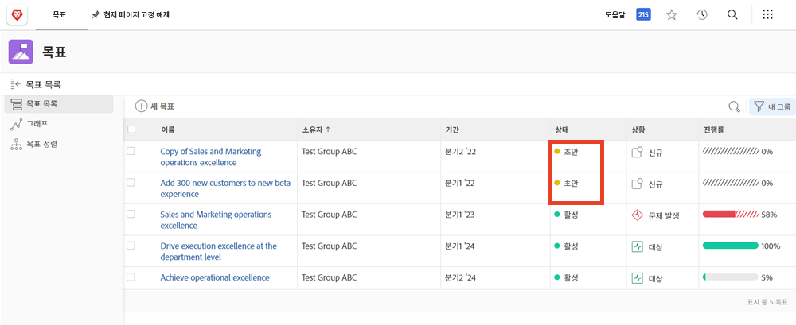
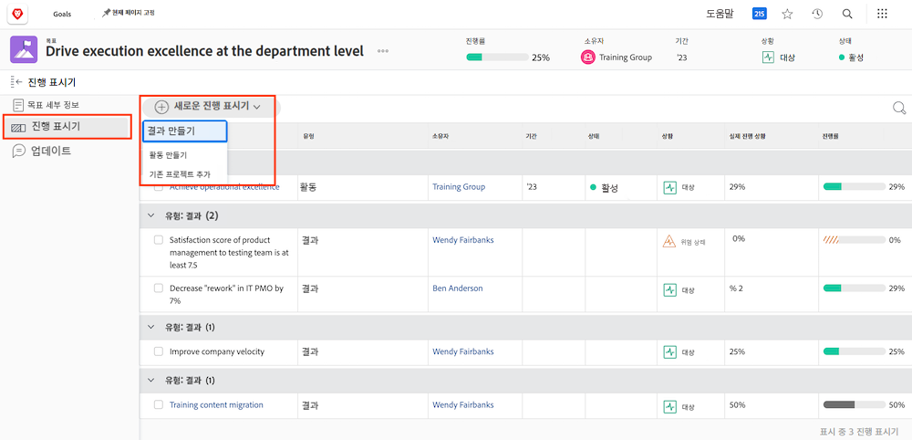
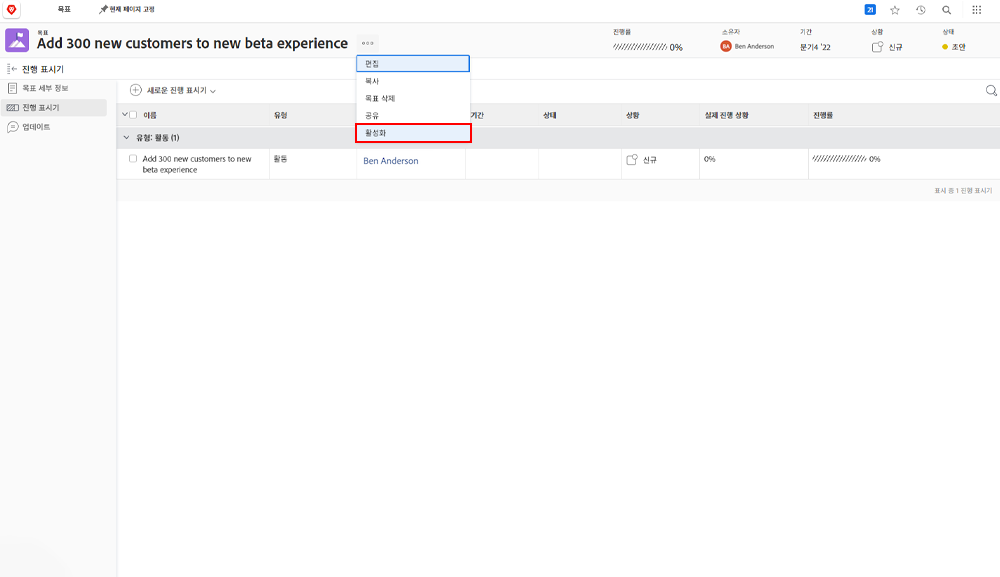

# 에서 목표 활성화 [!DNL Workfront]

목표를 만들었으므로 이제 목표를 활성화해 보겠습니다! 목표를 생성하면에 저장됩니다. [!UICONTROL 초안] 상태. [!UICONTROL 초안] 목표는 활성화하기 전까지 목표 관리의 일부가 아닙니다. 활성화되면 로 전환됩니다 [!UICONTROL 활성] 대시보드의 진행률을 확인하고 전반적인 전략에 맞춰 정렬하는 방법을 보여 줍니다. 의 목표 [!UICONTROL 활성] 상태는 진행 표시기(일반적으로 활동, 결과, 프로젝트 또는 정렬된 목표(하위-상위 목표 관계)와 연결되어 있습니다.

## 목표를 활성화하려면 진행 표시기가 필요합니다.

계속하기 전에,에서 사용되는 진행 지표를 이해하는 것이 중요합니다. [!DNL Workfront Goals]. 진행 표시기는 의 객체입니다. [!DNL Goals] 목표의 진행률을 계산하는 데 사용됩니다. 진행 지표는 정렬된 목표, 결과, 활동 및 프로젝트입니다. 자세한 내용은 나중에 알 수 있습니다. 지금은 목표를 활성화하기 위해 정렬된 목표, 결과, 활동 및 프로젝트를 목표에 추가해야 한다는 것을 이해하는 것이 중요합니다.

진행 표시기를 추가하려면 목표를 열고 왼쪽의 진행 표시기 탭을 선택한 다음 그 옆에 있는 새 진행 표시기 드롭다운 메뉴를 선택합니다.

다른 진행 지표에 비해 사업은 활동의 한 종류로 여겨지기에 조금 독특하다. 활동은 수동 진행률 표시줄과 프로젝트, 이렇게 두 가지 유형으로 구분할 수 있습니다. 결과적으로 프로젝트도 진행률을 높입니다. 모든 유형의 진행률 지표는 상위 목표와 연결될 수 있지만 관리하는 방식에 차이가 있다는 점을 명심해야 합니다.

## 이제 목표 활성화

목표에 진행 표시기가 하나 이상 있는 경우 목표 이름 옆에 있는 점 3개를 클릭하면 활성화 옵션이 표시됩니다.

