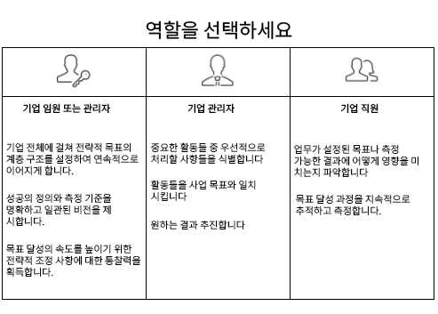

# 설정 [!UICONTROL Workfront 목표] 조직

*이 섹션은 [!DNL Workfront] 사용자를 위한 Workfront 목표 설정을 담당하는 시스템 관리자*

조직이 빠르게 진행될 수 있도록 하려면 작업 실행이 회사 전략과 일치하는지 확인해야 합니다. [!DNL   Goals] 조직 전반에서 실행 속도를 높이고 측정 가능한 비즈니스 결과를 제공하기 위한 전략, 목표 및 작업을 조정합니다.

목표 우수 사례는 최상위 수준의 기업 목표로 시작한 다음 그룹, 팀 및 개별 수준으로 이동합니다. 결과 목표는 기업 우선 순위를 달성하는 데 맞춰 정렬되고, 기여하고, 지원해야 합니다. in [!DNL Workfront], 목표는 목표를 달성하는 방법을 나타내는 결과나 활동에서 지원됩니다.

## [!DNL Workfront Goals] 검사 목록

액세스하기 전에 다음 조건을 충족해야 합니다. [!DNL   Goals]:

* 조직이 [!DNL Workfront Goals] 라이센스, [!DNL Workfront] 라이센스.
* 조직에서 새 [!DNL Workfront] 경험 인터페이스. [!DNL Workfront Goals] 클래식 UI에서는 사용할 수 없습니다 [!DNL Workfront] 인터페이스.
* 사용자 [!DNL Workfront Goals] 사용자에게 [!DNL Workfront Goals] 액세스 수준에서
* 을 포함하는 레이아웃 템플릿을 할당해야 합니다 [!DNL Workfront Goals] 기본 메뉴의 영역에서 사용자가 기능에 액세스할 수 있습니다.

## 사용 가능한 사용자 [!DNL Workfront Goals]

개별 기여자가 종종 개인적인 목표를 가지고 있지만, [!DNL Workfront Goals] 전략적 목표를 달성하기 위한 조직의 작업을 지원하기 위해 조직의 모든 구성원이 전체 회사 전략에 부합하고 일상 활동과 연결하는 목표를 설정하도록 권장되어야 합니다.

아래 역할 설명을 읽고 역할을 결정하십시오 [!DNL Workfront Goals].

경영진 및 관리자는 [!DNL Workfront Goals] 변환:

* 기업 전체에 걸쳐 배치되는 전략적 목표 계층을 구축하십시오.
* 성공의 형태와 그 측정 방법에 대한 통일되고 명확한 비전을 제공합니다.
* 목표 진행 속도를 가속화하기 위해 전략적 조정을 수행할 수 있는 사항에 대한 통찰력을 얻을 수 있습니다.

개별 기여자가 [!DNL Workfront Goals] 변환:

* 전반적인 회사 전략적 이니셔티브에 목표를 맞추다.
* 전략적 목표에 대한 진행 상황과 성과를 측정합니다.
* 비즈니스 방향에 맞게 개인 목표를 적절하게 조정할 수 있습니다.

