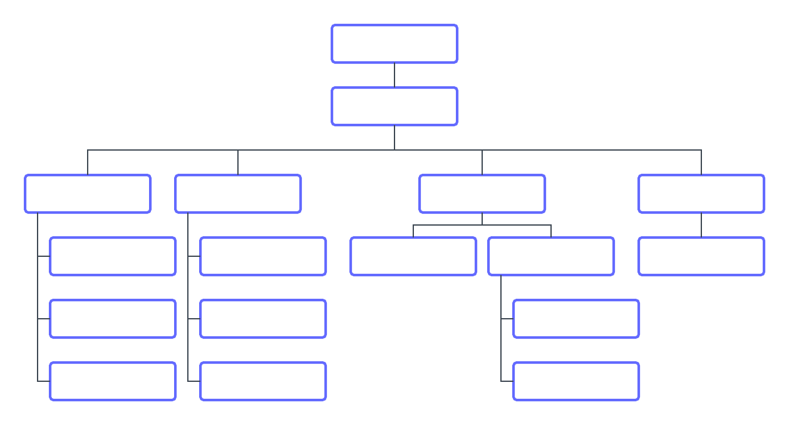

# 방법 이해 [!DNL Workfront Goals] 작품

이 비디오에서는 다음 사항에 대해 알아봅니다.

* 계획 단계에서 &quot;무엇&quot;과 &quot;이유&quot;를 명확히 설명
* 목표 예
* 영향 범위

>[!VIDEO](https://video.tv.adobe.com/v/335183/?quality=12&learn=on)

## 책임 있는 개인 지정

구성을 시작하기 전에 [!DNL Workfront Goals]따라서 각 목표의 달성을 이끌 책임자를 조직의 개인으로 식별해야 합니다.

몇 가지 방법으로 이 작업을 수행할 수 있습니다. [!DNL Workfront] 는 조직 차트를 스케치할 것을 권장합니다. 여러 층의 골 주인이 있을 가능성이 높다. 최고 수준의 리더십으로 시작한 다음 원하는 결과를 제공하는 데 필요한 작업을 수행할 책임이 있는 팀과 팀원을 식별합니다. 그들은 최고의 작품을 만들기 위해 어떤 목표를 향해 일하고 있는지에 대한 맥락이 필요하다.

다음으로, 한 걸음 물러나서 당신의 사람들을 보십시오. 전체 관리/편집 액세스 권한, 보기 전용 액세스 권한 및 액세스 권한이 전혀 필요 없는 사용자를 결정합니다. 액세스 권한이 전혀 없는 숫자는 상대적으로 작아야 합니다. 대부분의 사용자는 적어도 전략적 컨텍스트에 대한 목표를 확인해야 합니다.

>[!NOTE]
>
>주요 목표 소유자를 식별할 때 개인 개발 목표가 아닌 기업 성과에 대한 전략적 목표를 설정하고 있음을 고려하십시오. Workfront에서는 비즈니스 및 엔터프라이즈 목표에 직접 기여하거나 추진하는 개발 목표만 추가할 것을 권장합니다.

에서 설정을 설정하고 구성하는 방법을 보여 줍니다. [!DNL Workfront Goals], 2부: 목표를 만들고 관리합니다.

<!--
URL for part 2 reference above
-->
