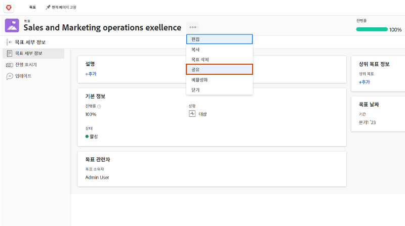

# 목표 상태 전달

목표를 업데이트했다면, 잠시 뒤로 물러나서 여러분이 작업하고 있는 목표들과 그들이 팀, 그룹, 그리고 회사 목표들과 어떻게 관련되는지를 조밀하게 살펴보는 것이 좋습니다. 목표 진행 상황과 상태에 대해 다른 사람과 소통하는 것은 정렬하는 데 중요한 부분입니다.

올바른 사람을 목표에 맞게 업데이트하는 방법에는 여러 가지가 있습니다. 다음을 기준으로 시작할 수 있습니다.

* 목표에 대한 공유 및 보고
* 활용 [!UICONTROL 그래프] 목표 진행 상황을 종합적으로 파악할 수 있는 섹션을 제공합니다.

## 목표 공유

만든 목표나 관리할 권한이 있는 다른 사람이 만든 목표를 공유할 수 있습니다. 그룹, 팀 또는 회사와 목표를 공유할 수 없습니다. 목표에 대한 관리 권한이 있는 경우 목표 작성자에 대한 목표 권한을 변경할 수 있습니다. 기본적으로 목표를 만드는 사람은 관리 권한이 있지만, 이 권한을 보기로 변경할 수 있습니다.

1. 의 섹션에서 공유할 목표 이름을 클릭합니다. [!DNL Goals] 열 영역 [!UICONTROL 목표 세부 사항] 패널.

1. 목표 이름 옆에 있는 3점 아이콘을 클릭한 다음 [!UICONTROL **공유**]. 다음 [!UICONTROL 목표 액세스] 상자가 표시됩니다.

   

1. 다음 중 하나를 수행하십시오.

   * 을(를) 선택합니다 [!UICONTROL 시스템 전체 관리] 편집 액세스 권한이 있는 시스템의 모든 사용자에게 관리 권한을 제공하는 설정 [!DNL Goals] 그들의 [!DNL Workfront] 액세스 수준. 이 옵션은 모든 새로운 목표에 대해 기본적으로 선택 취소되어 있습니다.
   * 제공할 사용자의 이름을 입력합니다 [!UICONTROL 관리] 에 대한 권한 [!UICONTROL 관리 액세스 권한 부여] 상자. 목록에 표시될 이름을 선택합니다.

1. 클릭 [!UICONTROL **공유**]. &quot;시스템 전체&quot; 레이블 또는 목표에 대한 관리 권한이 있는 사용자 이름이 [!UICONTROL 관리 액세스] 의 필드 [!UICONTROL 목표 세부 사항] 패널.

## 목표 정보에 대한 보고서

에 연결된 목표에 대한 정보를 포함하는 목표 보고서 또는 프로젝트 보고서를 작성할 수 있습니다 [!DNL Workfront]. 보고서에서 목표 정보를 보는 방법에는 몇 가지가 있습니다.

* 보고서 영역에서 목표 보고서를 생성합니다. 목표 보고서에 목표에 대한 다양한 정보를 표시할 수 있습니다(예: 이름, 소유자, 날짜, 진행률 등)이며 다음과 같습니다.

   * **목표 계층**- 모든 상위 목표와 상위 목표가 서로 연결되는 방식을 표시합니다.
   * **회사 목표입니까?**- 조직이 목표 소유자로 지정되었는지 여부를 나타냅니다.
   * **소유자 유형**— 목표 소유자가 사용자, 팀 또는 그룹인지 여부를 나타냅니다.

* 다음을 포함하여 목표 정보를 표시하는 프로젝트 보고서를 만듭니다.
   * **목표 계층**- 모든 상위 목표와 상위 목표가 서로 연결되는 방식을 표시합니다.
   * **목표**- 프로젝트와 관련된 모든 목표를 표시하는 컬렉션 필드입니다.
   * **연결된 목표 수**- 프로젝트와 관련된 목표 수입니다.
