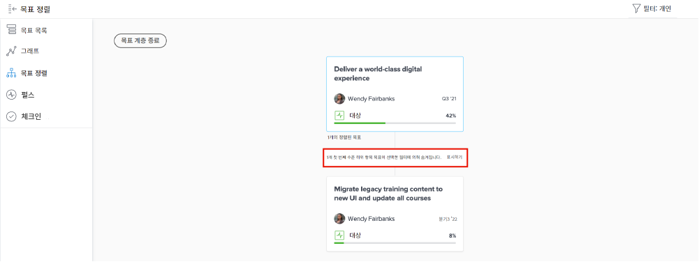

# 개인 목표 업데이트 보기

이 비디오에서는 다음 방법을 배우게 됩니다.

* [!UICONTROL 펄스] 업데이트 스트림의 개인 목표 보기

>[!VIDEO](https://video.tv.adobe.com/v/3415932/?quality=12&learn=on&enablevpops=1&captions=kor)

## 펄스 스트림의 정보 필터링

[!UICONTROL 펄스] 스트림에서 너무 많은 정보를 얻거나 올바른 정보가 아닌 경우도 있습니다. 피드 정보를 필터링하여 원하거나 필요한 정보만 확인합니다.

1. 왼쪽 패널에서 [!UICONTROL **펄스**]&#x200B;를 클릭합니다.
1. 오른쪽 상단의 [!UICONTROL **필터**] 아이콘을 클릭합니다.
1. 필터링할 옵션을 선택합니다. 모두 필터가 기본으로 적용되며 시스템의 모든 목표를 표시합니다. 다음 중 하나를 수행할 수 있습니다.

   * 미리 정의된 필터(필터 패널의 [!UICONTROL 저장됨] 섹션 아래에 나열됨)를 선택하여 소유자(예: [!UICONTROL 모두], [!UICONTROL 개인], [!UICONTROL 내 팀], [!UICONTROL 내 그룹] 및 [!UICONTROL 기업])의 목표를 표시합니다.
   * 필터 이름 위로 마우스 커서를 이동한 다음, 이름 옆에 있는 **편집** 아이콘을 클릭하여 필터를 사용자 정의하고 특정 사용자, 팀, 그룹 또는 조직 이름을 추가합니다.
   * [!UICONTROL **새 필터**]&#x200B;를 클릭하여 새 필터를 만든 다음 [!UICONTROL 기간], [!UICONTROL 상태], [!UICONTROL 진행 상황] 및/또는 [!UICONTROL 소유자]별로 사용자 정의하여 필터링할 옵션 목록에서 선택합니다.

   ![[!DNL Workfront Goals]](assets/18-workfront-goals-pulse-stream.png)의 [!UICONTROL 필터] 패널 이미지

**메모:** 필터링 선택이 유지되어 다른 [!DNL Goals] 섹션의 정보가 이 정보에 따라 표시됩니다. [!DNL Workfront] [!DNL Goals] 영역의 다양한 섹션에서 목표를 찾고 필터링할 수 있습니다.

* [!UICONTROL 목표 목록]
* [!UICONTROL 그래프]
* [!UICONTROL 펄스]
* [!UICONTROL 목표 정렬]. 이 섹션에서는 적용한 필터와 일치하지 않는 목표를 일시적으로 표시하여 정렬된 모든 목표를 전반적으로 볼 수 있습니다. 선택한 필터에 의해 숨겨진 목표가 있는 경우, [!UICONTROL **표시**] 옵션을 클릭합니다.

  
