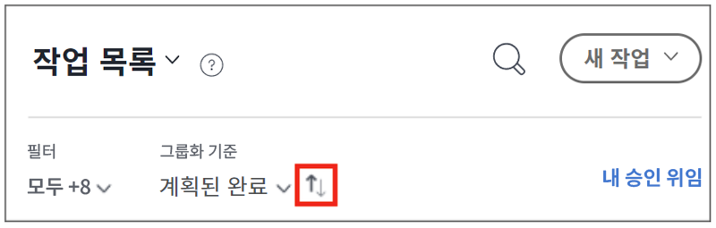

# 에서 할 일 목록 구성 [!DNL Workfront] [!UICONTROL 홈]

>[!NOTE]
>
>다음 [!UICONTROL [!DNL Sort by]] 옵션 [!UICONTROL 작업 목록] 의 이름이 [!UICONTROL 그룹화 기준], 및 작업 및 문제를 [!UICONTROL 계획 시작 날짜].

이 비디오에서는 다음 방법을 배웁니다.

* 작업 지정 정렬
* 유형별 작업 할당 필터링
* 시작할 준비가 된 작업 확인
* 작업 지정 수락

>[!VIDEO](https://video.tv.adobe.com/v/335099/?quality=12)

>[!NOTE]
>
>기본적으로 가장 이른 납기 품목은 [!UICONTROL 작업 목록]. 작업 항목을 내림차순으로 표시하려면 [그룹별] 영역 오른쪽에 있는 화살표를 클릭합니다.

