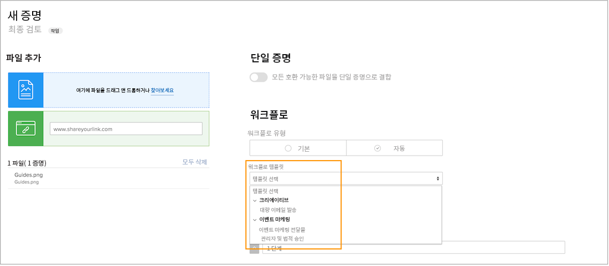
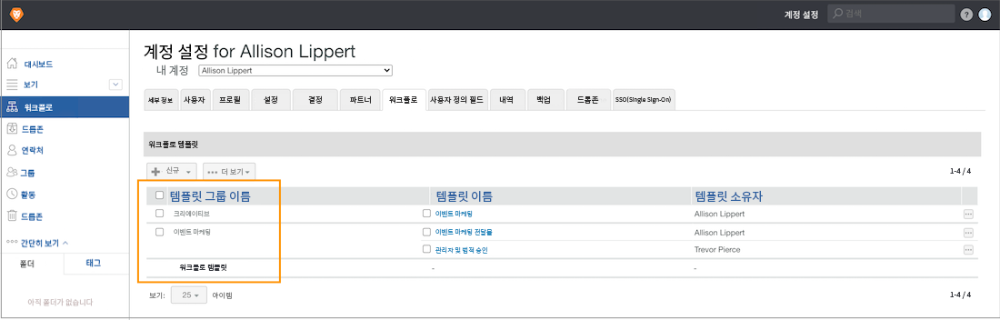

# 템플릿 그룹을 만들어 자동화된 워크플로우 템플릿 구성

자동화된 워크플로우 템플릿을 만들기 전에 [!DNL Workfront] 템플릿 구성에 도움이 되도록 템플릿 그룹을 만드는 것이 좋습니다. 그룹 — 다양한 템플릿을 보관하기 위한 버킷으로 생각하십시오. 교정을 사용하는 여러 팀이나 부서가 있을 때 유용합니다. 템플릿을 구성하면 검토 및 승인 프로세스를 할당하여 사용할 템플릿을 파악할 수 있습니다.

템플릿을 그룹으로 구성하는 방법을 아직 모를 경우 나중에 그룹 정보를 추가할 수 있습니다. 그러나 템플릿을 만들 때 템플릿 그룹을 할당하는 것이 더 쉽습니다.

증명 설정뿐만 아니라 증명 워크플로우를 적용하는 동안 템플릿을 선택할 때에도 이러한 그룹이 표시됩니다. 템플릿 목록의 굵은 용어는 그룹입니다.

템플릿 그룹은 선택 사항입니다. 조직에 몇 개의 템플릿만 있는 경우 그룹으로 구성할 필요가 없습니다.

**템플릿 그룹을 만들려면**

1. 선택 **[!UICONTROL 교정]** 에서 **[!UICONTROL 기본 메뉴]** in [!DNL Workfront].
1. 선택 **[!UICONTROL 계정 설정]** 교정 설정 영역이 열리면
1. 이동 **[!UICONTROL 워크플로우]** 왼쪽 패널 메뉴에서 를 클릭합니다.
1. 선택 **[!UICONTROL 새 템플릿 그룹]** 에서 **[!UICONTROL 새로 만들기]** 버튼을 클릭합니다.
1. 그룹 이름을 지정합니다.
1. 저장할 필드 바깥쪽을 클릭합니다.

이제 새 그룹이 목록에 표시됩니다.

## 그룹 삭제

템플릿이 들어 있는 그룹을 삭제하면 해당 템플릿이 보존되고 일반 &quot;[!UICONTROL 워크플로우 템플릿]&quot; 그룹에 속해 있어야 합니다. 필요한 경우 템플릿을 다른 그룹으로 이동할 수 있습니다.

<!--
Learn More Icon
Create and manage Automated Workflow templates
-->
