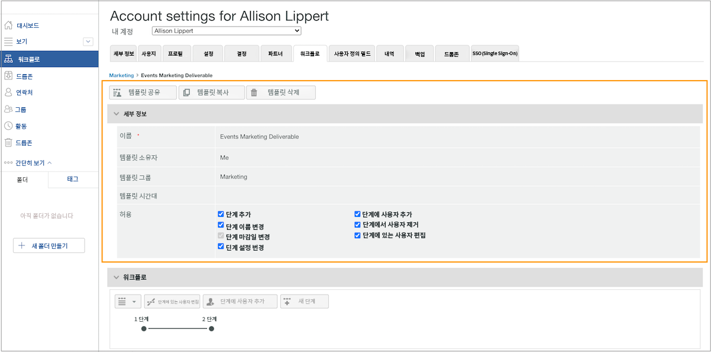
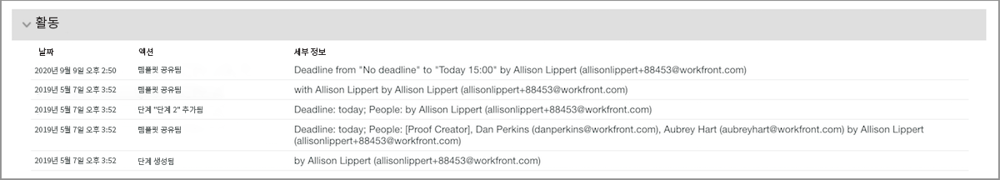

# 자동화된 워크플로우 템플릿 편집

증명 검토 및 승인 프로세스가 조정되거나 조직 변경이 수행되면 Workfront을 사용하는 팀의 현재 작업을 반영하도록 자동화된 워크플로우 템플릿을 업데이트해야 합니다.

템플릿을 최신 상태로 유지하면 검토 및 승인 프로세스에서 일관성을 유지할 수 있고, 워크플로우를 지속적으로 조정할 필요가 없으므로 이러한 증명 업로드 시간을 절약할 수 있습니다.

1. 선택 **[!UICONTROL 교정]** 에서 **[!UICONTROL 기본 메뉴]** in [!DNL Workfront].
1. 여기에서 을 선택합니다 **[!UICONTROL 워크플로우]** 왼쪽 패널 메뉴에서 를 클릭합니다.
1. 템플릿 이름의 맨 오른쪽에 있는 3점 메뉴를 클릭하고 을 선택합니다 **[!UICONTROL 템플릿 세부 사항 보기]**.

템플릿을 공유, 복사 및 삭제하는 옵션은 각 템플릿에 대한 템플릿 세부 정보 창의 맨 위에 있습니다. 템플릿을 삭제해도 해당 템플릿이 적용된 진행 중인 증명에는 영향을 주지 않지만, 템플릿을 더 이상 사용할 수 없음을 의미합니다.

<!--
Lean More URLs
-->

화살표를 클릭하여 [!UICONTROL 세부 사항] 템플릿 이름 또는 템플릿 시간대 등의 변경 사항을 섹션에 추가했습니다.

## 단계 및 수신자 변경

에서 변경 사항이 필요할 수 있습니다. [!UICONTROL 워크플로우] 간소화된 프로세스가 이전 마감일을 의미하거나 누군가 팀에 합류할 때 증명을 검토할 때 영역입니다.

자동화된 워크플로우의 각 단계에는 마감일, 개인 정보 보호, 증명 수신자 및 기타 정보를 독립적으로 수정할 수 있는 자체 섹션이 있습니다.

이 비디오에서는 의 [!UICONTROL 워크플로우] 영역. 이 설정을 검토하는 이 비디오 아래의 글머리 기호 목록을 참조하십시오. 이 비디오에 오디오가 없습니다.

>[!VIDEO](https://video.tv.adobe.com/v/335131/?quality=12)

다음은 검토에서 수행할 수 있는 증명 템플릿 변경 사항입니다 [!UICONTROL 워크플로우] 섹션:

* 을(를) 클릭하여 [!UICONTROL 스테이지 이름] 필드 또는 [!UICONTROL 기한] 해당 정보를 업데이트하는 필드입니다.
* 다음 옆의 화살표를 선택합니다 [!UICONTROL 기한] 스테이지를 잠그려면 스테이지가 활성화되는 시점을 결정하거나 하나의 결정만 필요합니다.
* 수신자 목록에서 을(를) 클릭합니다. [!UICONTROL 역할] 또는 [!UICONTROL 이메일 경고] 다른 옵션을 선택하는 필드입니다.
* 수신자 이름의 맨 오른쪽에 있는 3점 메뉴로 이동하여 목록에서 삭제하거나, 해당 워크플로우 단계의 주요 의사 결정 업체로 지정하거나, 증명 역할과 전자 메일 경고 정보를 편집합니다.
* 목록에 수신자를 추가할 수 있는 두 가지 옵션이 있습니다. 일단 을 열면 [!UICONTROL 스테이지에 사람 추가] 창에서 추가할 스테이지를 클릭합니다. 그런 다음 수신자 목록에 이름이나 이메일 주소를 입력하고 증명 역할과 이메일 경고를 지정합니다. 을(를) 클릭합니다. [!UICONTROL 사용자 추가] 완료 후 단추를 누릅니다.
   1. 각 스테이지 섹션의 오른쪽 위 모서리에서 [!UICONTROL 자세히] 메뉴 및 선택 [!UICONTROL 스테이지에 사람 추가].
   1. 맨 위에 [!UICONTROL 워크플로우] 영역, 선택 [!UICONTROL 스테이지에 사람 추가].

## 템플릿 공유

다음 [!UICONTROL 공유 대상] 영역에는 템플릿을 사용할 수 있는 증명 사용자가 표시됩니다. 이름 맨 오른쪽에 있는 3점 메뉴를 클릭하고 을 선택하여 템플릿을 더 이상 사용할 필요가 없는 사용자를 제거합니다 [!UICONTROL 제거].

![[!UICONTROL 공유 대상] list](assets/proof-system-setups-edit-template-shared-with.png)

그러나 이 섹션에서 공유 목록에 사용자를 추가할 수는 없습니다. 이렇게 하려면 템플릿 세부 정보 창의 맨 위로 돌아가서 [!UICONTROL 템플릿 공유] 버튼을 클릭합니다.

## 활동 섹션

[!DNL Workfront] 는 템플릿을 변경한 시간의 감사 기록을 유지합니다. 날짜, 변경을 수행한 사용자 및 변경 내용에 대한 간단한 정보를 확인할 수 있습니다.

이 섹션에서는 증명에서 템플릿을 사용한 시기에 대한 정보를 기록하지 않습니다.

