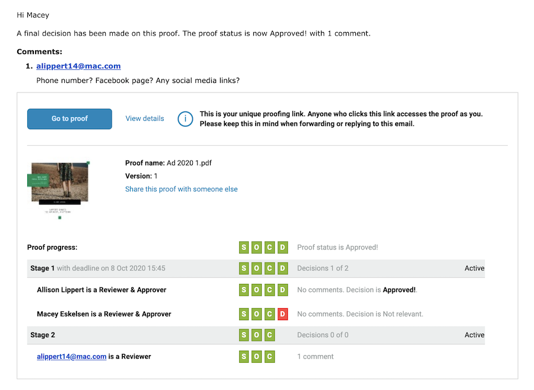

# 이메일 경고 및 증명 알림 이해

이메일 경고는 증명 알림 이메일과 다릅니다. 검토할 새 증명이 할당되거나, 증명이 늦어지거나, 검토할 새 증명 버전이 있는 경우 증명 알림 이메일을 받게 됩니다.

증명을 업로드할 때 알림 옵션을 끄면 [!DNL Workfront]로부터 검토할 새 증명이 있다는 것에 대한 통신을 받지 못합니다.

이메일 경고는 검토자/승인자별로 설정되며, 대부분 증명이 업로드될 때 설정됩니다. 증명을 업로드할 때마다 기본 이메일 경고 유형을 설정할 필요가 없도록 증명 수신자에게 기본 이메일 경고 유형이 할당될 수 있습니다. 이러한 기본값을 설정하는 방법에 대해서는 시스템 관리자에게 문의하십시오.

이메일 경고가 [!UICONTROL 비활성화됨]으로 설정된 경우에도 증명 수신자는 새 증명 또는 버전에 대한 알림을 받습니다.

## 우수 사례

| 우수 사례 | 이유는 다음과 같습니다. |
|---|---|
| Workfront 설정에서 &quot;증명에 댓글이 달리면 Workfront에서 이메일 보내기&quot; 설정을 비활성화합니다 | 이 설정이 활성화되면(기본적으로 활성화됨) 사용자는 증명 기능에서 하나, Workfront 자체에서 하나 등 증명에 대한 각 댓글에 대해 여러 이메일 알림을 받을 수 있습니다. 이러한 중복 알림은 이메일 알림 중단 및 혼란뿐만 아니라 전체 이메일 받은 편지함으로 이어져 궁극적으로는 사용자가 받은 증명 알림을 무시할 수 있습니다. 이것은, 결과적으로, 마감일을 놓쳤다는 것을 의미할 수 있다.    참고: 이 설정은 Workfront 기본 메뉴 > 설정 > 이메일 > 검토 및 승인에서 찾을 수 있습니다. |

