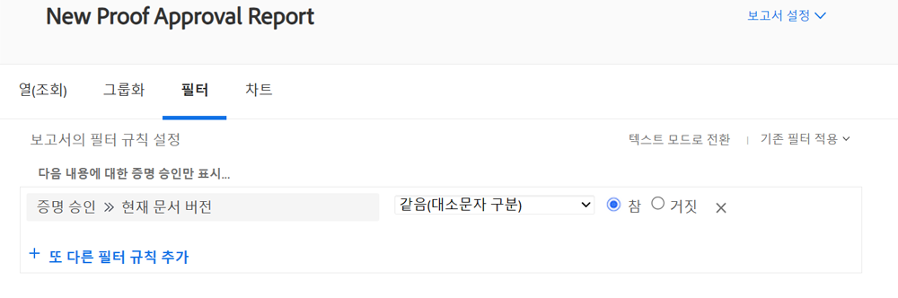
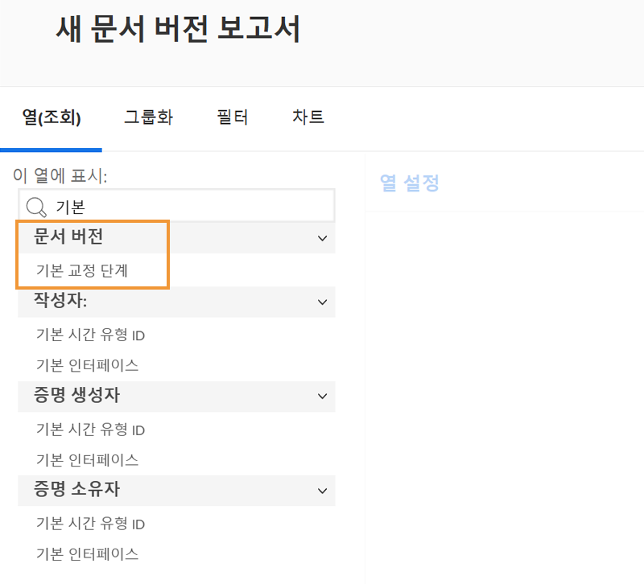
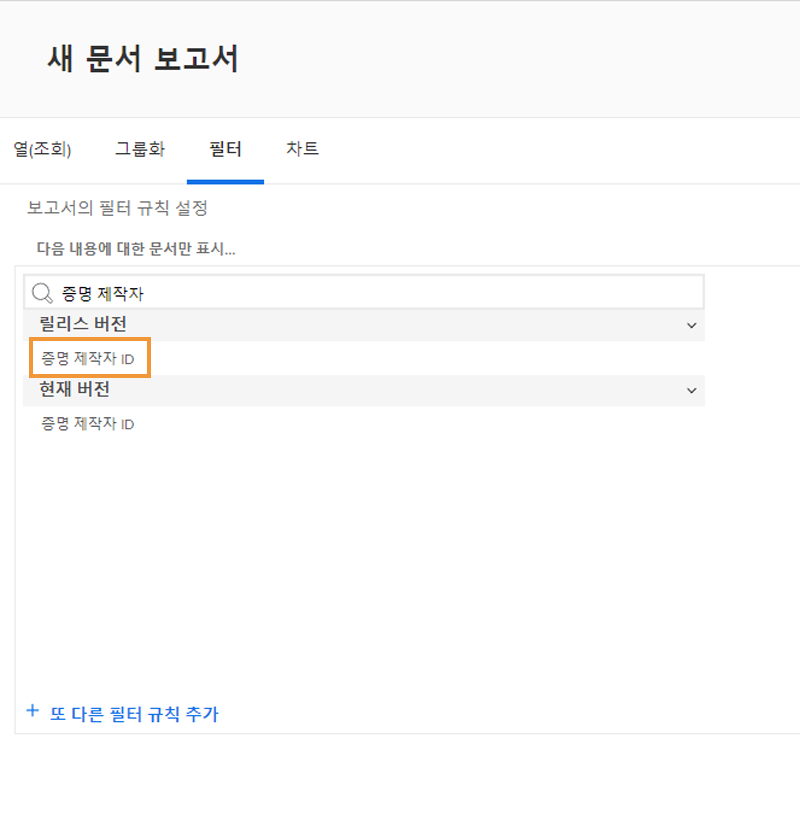

# 증명 보고

[!DNL Workfront]의 디지털 증명 기능을 통해 프로젝트 및 관련 검토 워크플로를 [!DNL Workfront] 한 곳에서 모두 관리할 수 있습니다. 검토 및 승인 정보를 표시하는 보고서 유형, 필드 소스 및 필드 이름으로 수행 중인 증명 작업에 대한 귀중한 인사이트를 얻습니다.

[!DNL Workfront] 컨설턴트와 협력하여 조직의 요구 사항에 맞는 보고서를 작성하는 것이 좋습니다. 일부 보고서는 [!DNL Workfront] 텍스트 모드 보고에 대해 숙지해야 합니다.

팀이 [!DNL Workfront]의 검토 및 승인 프로세스를 통해 증명을 관리할 수 있도록 기본 표준 보고서로 시작합니다.

## [!UICONTROL 증명 승인]

이 보고서 유형은 기한이 충족되었는지 확인하기 위해 처리되지 않은 증명 승인을 추적할 수 있습니다.

![[!UICONTROL 새 보고서] 드롭다운 메뉴의 [!UICONTROL 증명 승인] 선택](assets/proof-system-setups-proof-approval-report.png)

보기 및 필터 옵션에는 [!UICONTROL 결정 일자], [!UICONTROL 증명 승인], [!UICONTROL 승인자 단계], [!UICONTROL 워크플로 템플릿] 및 [!UICONTROL 요청자 정보]가 포함됩니다. 텍스트 모드 보고를 사용하면 문서 이름별로 목록을 구성하는 그룹을 만들 수 있습니다. [그룹화의 기본 텍스트 모드 이해](https://experienceleague.adobe.com/docs/workfront-learn/tutorials-workfront/reporting/intermediate-reporting/basic-text-mode-for-groupings.html?lang=ko-KR)를 참조하십시오.

증명 승인 보고서를 작성할 때 가장 최신 버전의 증명과 관련된 정보를 얻고 있는지 확인합니다. [!DNL Workfront]는 필터에 이 필드 소스 및 필드 이름을 포함할 것을 권장합니다.

**[!UICONTROL 증명 승인]>>[!UICONTROL 현재 문서 버전임]**

여러 버전이 있는 증명에 대해 보고할 때 유용하므로 보고서에는 승인이 필요한 각 증명의 현재 버전만 나열됩니다. 이렇게 하면 더 이상 작업할 필요가 없는 이전 버전이 필터링됩니다.

## [!UICONTROL 문서 버전]

이 보고서 유형을 사용하면 [!DNL Workfront]에서 버전을 관리하고 추적할 수 있습니다.

![[!UICONTROL 새 보고서] 드롭다운 메뉴에서 [!UICONTROL 문서 버전] 선택](assets/proof-system-setups-document-version-report.png)

보기 옵션에는 [!UICONTROL 문서 버전], [!UICONTROL 문서], [!UICONTROL 입력한 사용자], [!UICONTROL 증명 승인 상태], [!UICONTROL 증명 작성자] 및 [!UICONTROL 문서 공급자]의 정보가 포함됩니다.

그룹화는 [!UICONTROL 문서 버전], [!UICONTROL 입력한 사용자], [!UICONTROL 증명 승인 상태] 또는 증명 소유자 정보별로 수행할 수 있습니다.

필터에는 [!UICONTROL 문서 버전], [!UICONTROL 액세스 수준], [!UICONTROL 문서], [!UICONTROL 입력한 사용자], [!UICONTROL 증명 승인 상태], [!UICONTROL 증명 작성자] 및 문서 공급자 정보가 포함됩니다.

보기에서 이 열을 사용하여 보고서의 각 문서에 대해 현재 활성 상태인 증명 단계의 이름을 표시할 수 있습니다.

**[!UICONTROL 문서 버전] >> [!UICONTROL 활성 증명 단계]**

현재 활성화된 단계가 없으면 열이 비어 있습니다.

이 필드 소스 >> 필드 이름도 보고서에서 필터로 사용할 수 있습니다.

[!UICONTROL 증명 작성자] 필드 소스를 사용하여 증명을 작성한 사용자에 대한 정보를 보고합니다. 보기에 증명 작성자의 이름을 표시하려면 [!UICONTROL 이름] 필드 소스를 선택합니다.

**[!UICONTROL 증명 작성자] >> [!UICONTROL 이름]**

이 필드 소스 >> 필드 이름 콤보도 필터로 사용할 수 있습니다.

<!--
Learn More Icon
Learn how to create reports in [!DNL Workfront] with the Report Creation class.
Access to proofing functionality
-->
