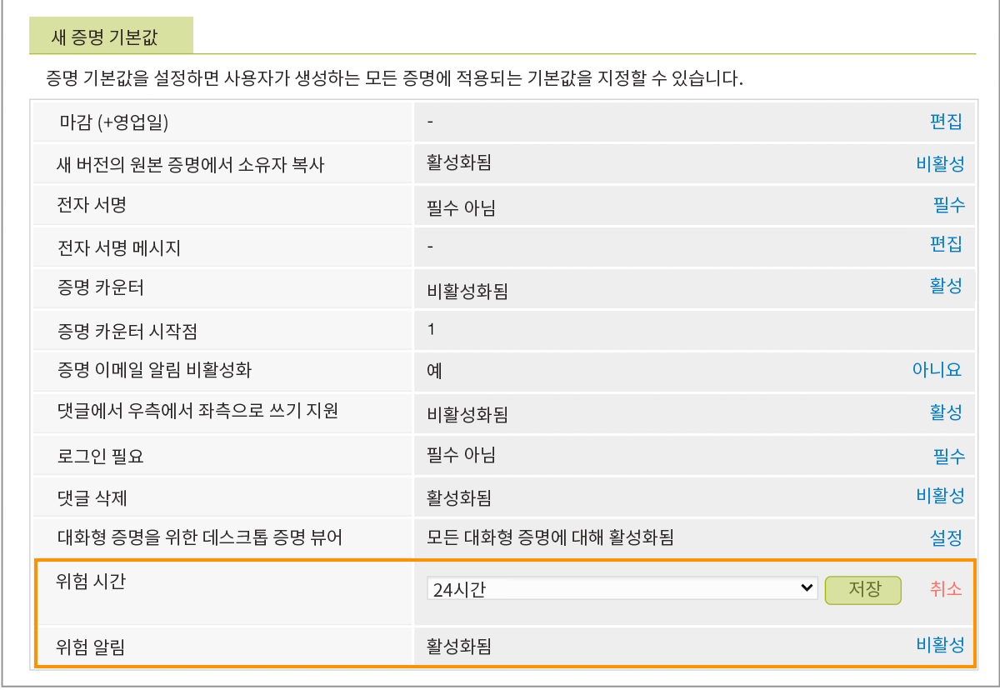

# 위험 증명 설정에서 기본값 설정

다음과 같은 위험 알림에 대한 설정을 설정하려고 합니다. [!DNL Workfront] 전송 중입니다. 이들은 아직 결정을 내리지 않은 증명 소유자 및 승인자에게 다가올 증명 마감일에 대해 부드럽게 상기시키는 것입니다.

위험 상황 알림이 기본적으로 켜져 있으며 증명은 증명 마감일 24시간 전에 &quot;위험 중&quot;으로 간주됩니다. [!DNL Workfront] 는 24시간 간격으로 이 알림을 설정할 것을 권장합니다. 그러나 조직 내 증명 전환 시간이 일 대신 시간 인 경우 이 시간을 단 몇 시간까지 단축할 수 있습니다.

1. 선택 **[!UICONTROL 교정]** 변환 전: [!DNL Workfront’s] [!UICONTROL 기본 메뉴].
1. 선택 **[!UICONTROL 계정 설정]** 를 클릭합니다.
1. 을(를) 선택합니다 **[!UICONTROL 설정]** 탭.
1. 로 이동합니다. [!UICONTROL 증명 기본값] 섹션을 참조하십시오.
1. 에서 [!UICONTROL 위험 시점] 필드, 선택 **[!UICONTROL 설정]**. 그런 다음 알림을 전송해야 하는 증명 마감일 전 시간 수를 선택합니다.
1. 선택 **[!UICONTROL 저장]** 참조하십시오.
1. 꼭 그렇게 적혀 있는지 확인하세요 [!UICONTROL 활성화됨] 에서 [!UICONTROL 위험 알림] 필드. 없는 경우 링크를 클릭하여 설정을 켜십시오.

## 네 차례야

1. Workfront에 로그인하고 설정 영역으로 이동합니다. 검토 및 승인 섹션에서 지정된 증명 수신자 및 비수신자에 대한 설정을 선택합니다.
1. 이제 Workfront의 기본 메뉴를 사용하여 증명 설정으로 이동합니다(교정 선택). 국가, 언어 및 시간대를 모든 증명 및 증명 사용자의 기본값으로 설정합니다.
1. 필요한 경우 증명 설정 영역의 설정 탭에서 위험 시 알림 시간을 조정합니다. 그들에게 가장 적합한 것을 결정하려면 증명을 사용하여 팀과 상의하십시오.

<!--
Lean More URLs
-->
