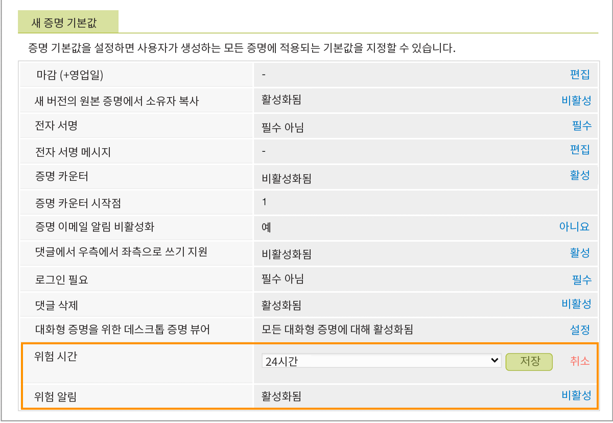

# 기본 마감 임박 교정쇄 설정 지정

[!DNL Workfront]에서 전송하는 위험 상태의 알림에 대한 설정을 구성하려고 합니다. 아직 결정을 내리지 않은 교정쇄 소유자 및 승인자에게 다가올 교정 기한에 대한 알림입니다.

마감 임박 시 알림은 기본적으로 켜져 있으며, 교정 기한 24시간 전에 교정쇄가 “마감 임박”한 것으로 간주됩니다. [!DNL Workfront]는 24시간 일정으로 이 알림을 켜두는 것이 좋습니다. 단, 조직의 교정쇄 처리 시간이 며칠이 아니라 몇 시간이면 이를 단 몇 시간으로 단축할 수 있습니다.

1. [!DNL Workfront’s] [!UICONTROL 메인 메뉴]에서 **[!UICONTROL 교정]**&#x200B;을 선택합니다.
1. 상단 탐색 막대에서 **[!UICONTROL 계정 설정]**&#x200B;을 선택합니다.
1. **[!UICONTROL 설정]** 탭을 선택합니다.
1. [!UICONTROL 교정쇄 기본값] 섹션으로 이동합니다.
1. [!UICONTROL 위험 시간] 필드에서 **[!UICONTROL 설정]**&#x200B;을 선택합니다. 그런 다음 알림을 보내야 하는 교정 기한 이전 시간을 선택합니다.
1. 해당 설정에 대해 **[!UICONTROL 저장]**&#x200B;을 선택합니다.
1. [!UICONTROL 위험 시 알림] 필드에 [!UICONTROL 활성화됨]이라고 표시되어 있는지 확인합니다. 그렇지 않은 경우, 링크를 클릭하여 설정을 켭니다.

## 사용자 차례

1. Workfront에 로그인하고 설정 영역으로 이동합니다. 검토 및 승인 섹션에서 지정된 교정쇄 수신자 및 비수신자에 대한 설정을 선택합니다.
1. 이제 Workfront의 메인 메뉴를 사용하여 교정쇄 설정으로 이동합니다(교정쇄 선택). 국가, 언어 및 시간대를 모든 교정쇄 및 교정쇄 사용자의 기본값으로 설정합니다.
1. 필요한 경우, 교정쇄 설정 영역의 설정 탭에서 위험 시 알림 시간을 조정합니다. 교정쇄를 통해 팀과 대화하여 가장 적합한 사항을 결정합니다.

<!--
Lean More URLs
-->
