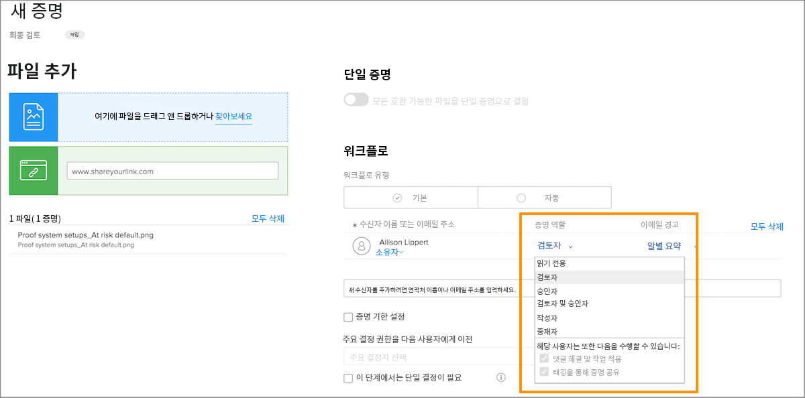
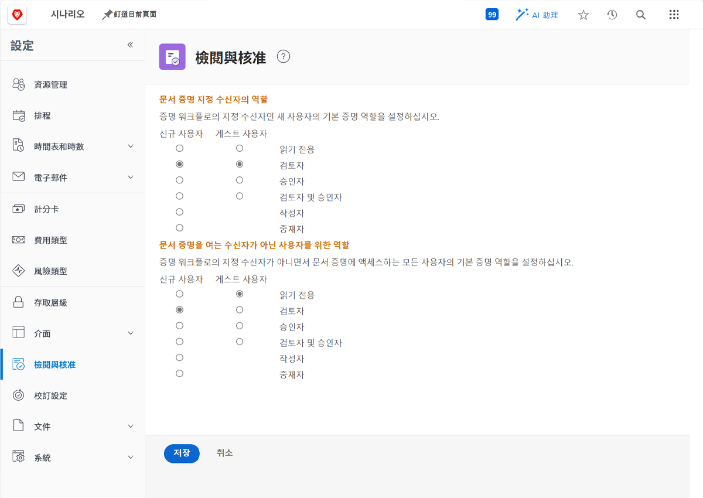

# 기본 증명 역할 설정

<!---
21.4 updates have been made
--->

첫 번째로 완료해야 하는 기본 설정은 새 사용자가 만들어지거나 사람들이 증명을 열 때 할당되는 기본 증명 역할을 결정하는 것입니다.

증명 역할은 사용자가 증명을 사용하여 수행할 수 있는 작업을 결정합니다. 확인, 댓글 작성, 승인 등을 할 수 있습니다. [!DNL Workfront] 는 증명에 수신자를 추가하고 워크플로를 보다 빠르고 쉽게 설정할 수 있도록 모든 사용자에 대해 증명 역할 기본값을 설정할 것을 권장합니다.

그러나 개별 증명이 업로드될 때 이 기본 증명 역할을 변경할 수 있으므로 모든 사람이 검토 및 승인 프로세스에서 필요한 역할을 수행할 수 있게 됩니다.

## 기본 증명 역할 설정

1. 선택 **설정** 다음에서 [!UICONTROL 메인 메뉴].
1. 선택 **검토 및 승인** 왼쪽 메뉴에서
1. 새 증명 역할에 대해 원하는 기본 증명 역할 옆의 버튼을 클릭합니다 [!DNL Workfront] &quot;지정된 수신자&quot;에 대한 사용자 및 게스트 증명 사용자 — 수동으로 또는 워크플로 템플릿을 통해 증명 워크플로에 추가되는 모든 사용자
1. 새 증명 역할에 대해 원하는 기본 증명 역할 옆의 버튼을 클릭합니다 [!DNL Workfront] &quot;수신자가 아닌&quot; 사용자에 대한 사용자 및 게스트 증명 사용자. 일반적으로 다음과 같습니다. [!DNL Workfront] 증명에 대한 액세스 권한은 있지만 워크플로에 할당된 사람 중 하나가 아닌 사용자.
1. 변경 사항을 저장합니다.

증명 워크플로에 사용자 및 게스트가 추가되면 예상되는 작업을 고려하십시오. 이것이 기본값이어야 합니다.
