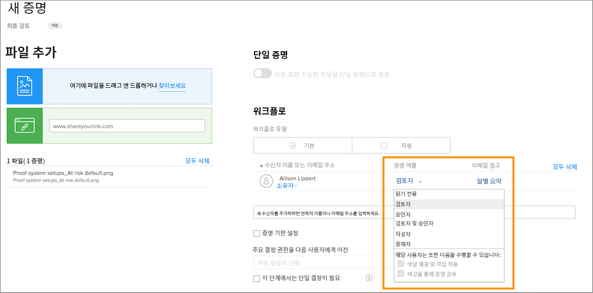
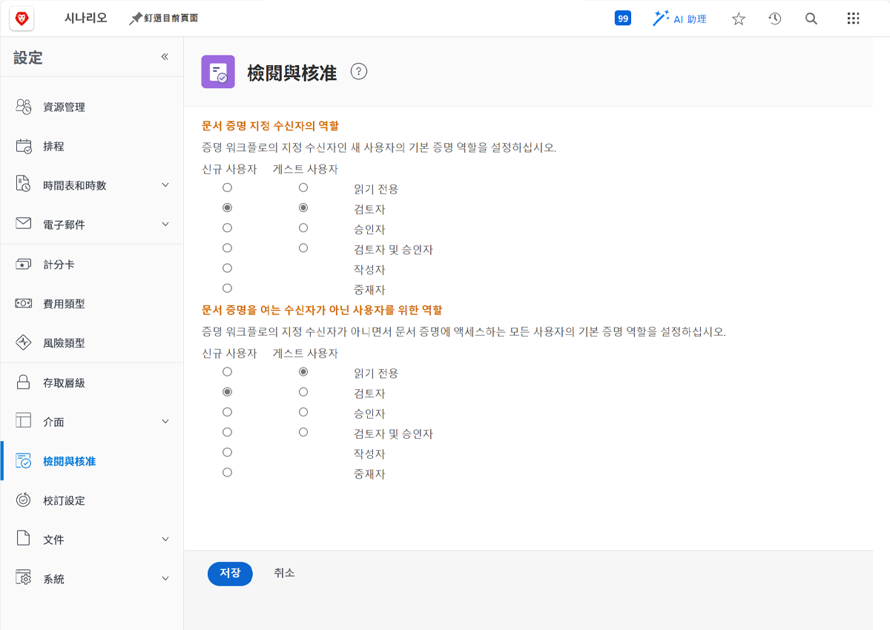

# 기본 교정 역할 설정

완료할 첫 번째 기본 설정은 새 사용자가 생성되거나 사람들이 교정쇄를 열 때 할당될 기본 교정 역할을 결정하는 것입니다.

증명 역할은 사용자가 증명을 사용하여 수행할 수 있는 작업을 결정합니다. 확인, 댓글 작성, 승인 등. [!DNL Workfront]은(는) 증명에 수신자를 추가하고 워크플로를 보다 빠르고 쉽게 설정할 수 있도록 모든 사용자에 대해 증명 역할 기본값을 설정할 것을 권장합니다.

그러나 이 기본 교정 역할은 개별 교정쇄가 업로드될 때 변경될 수 있으므로 모든 사람이 검토 및 승인 프로세스에서 필요한 역할을 수행할 수 있습니다.

## 기본 교정 역할 설정

1. [!UICONTROL 메인 메뉴]에서 **설정**&#x200B;을 선택합니다.
1. 왼쪽 메뉴에서 **검토 및 승인**&#x200B;을 선택합니다.
1. 수동으로 또는 워크플로 템플릿을 통해 교정 워크플로에 추가된 모든 사용자인 “지정된 수신자”에 대해 새 [!DNL Workfront] 사용자와 게스트 교정쇄 사용자 모두에게 원하는 기본 교정 역할 옆에 있는 버튼을 누릅니다.
1. 새 [!DNL Workfront] 사용자와 “비수신자” 사용자 모두에 대해 원하는 기본 교정 역할 옆에 있는 버튼을 클릭합니다. 일반적으로 교정쇄에 액세스할 수 있는 [!DNL Workfront] 사용자이지만, 워크플로에 할당된 사용자는 아닙니다.
1. 변경 사항을 저장합니다.

대부분의 사용자와 게스트를 교정 워크플로에 추가할 때 예상되는 작업을 고려합니다. 이는 기본값이 됩니다.

## 모범 사례

| 모범 사례 | 이유 |
|---|---|
| Workfront에서 “문서 교정쇄를 여는 수신자가 아닌 사람의 역할” 설정에 대해 읽기 전용 또는 검토자만 사용합니다. | 이 설정에 대한 다른 옵션은 모두 교정쇄 결정을 내려야 하며, 이 경우 교정 워크플로를 방해할 수 있습니다. 일반적으로 교정 워크플로에 추가되지 않은 사람은 교정쇄를 보거나 댓글을 작성하기만 하면 되고 실제로 교정쇄를 승인하지 않으므로 읽기 전용 또는 검토자 옵션이 가장 좋습니다.    메모: 이 설정은 Workfront 메인 메뉴 > 설정 > 검토 및 승인에서 확인할 수 있습니다. |
