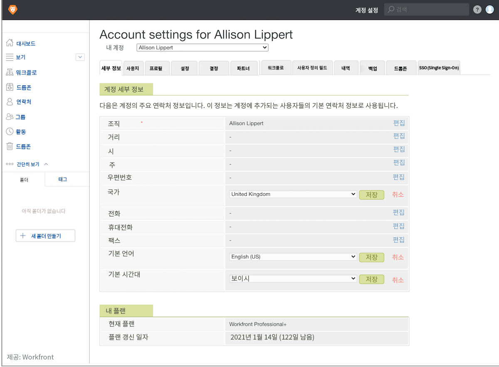

# 증명 계정 기본 설정 설정 설정

모든 증명 및 교정 사용자(국가, 언어 및 시간대)에게 전체적으로 적용되는 기본 계정 설정을 설정하십시오. 여러 표준 시간대 또는 국가에 사용자가 있는 경우 필요한 경우 각 개인의 사용자 프로필에서 이러한 설정을 조정할 수 있습니다.

1. 선택 **[!UICONTROL 교정]** 변환 전: [!DNL Workfront’s] [!UICONTROL 기본 메뉴].
1. 선택 **[!UICONTROL 계정 설정]** 를 클릭합니다.
1. 을(를) 선택합니다 **[!UICONTROL 세부 사항]** 탭.
1. 이동 [!UICONTROL 국가] 필드 및 선택 **[!UICONTROL 편집]**. 대부분의 언어 교정 사용자가 기본값으로 있는 국가를 선택합니다.
1. 선택 **[!UICONTROL 저장]** 참조하십시오.
1. 로 이동합니다. [!UICONTROL 기본 언어] 필드 및 선택 **[!UICONTROL 편집]**. 대부분의 언어 교정 사용자가 기본값으로 사용할 언어를 선택합니다.
1. 선택 **[!UICONTROL 저장]** 참조하십시오.
1. 로 이동합니다. [!UICONTROL 시간대 기본값] 필드 및 선택 **[!UICONTROL 편집]**. 대부분의 교정 사용자가 기본값으로 있을 시간대를 선택합니다. 수동으로 설정되는 증명 워크플로우에서 인식하는 시간대가 됩니다. 증명 워크플로우 템플릿에도 적용되지만 각 템플릿에는 표준 시간대 설정이 있을 수 있습니다.
1. 선택 **[!UICONTROL 저장]** 참조하십시오.
