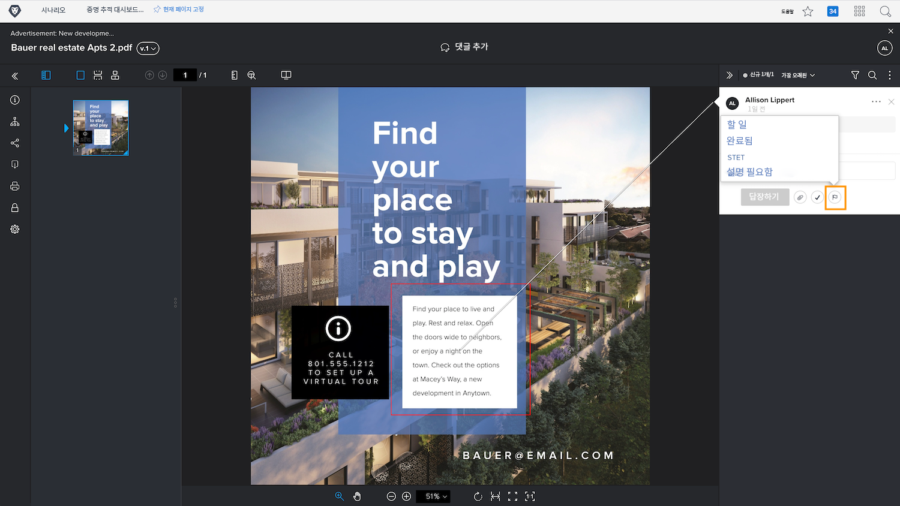
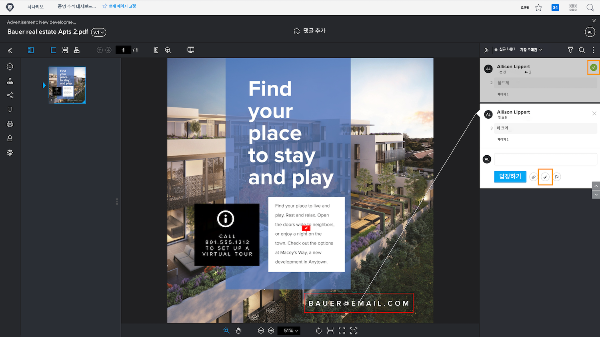

# 증명 주석 관리

[!DNL Workfront] 은 주석 작업 또는 주석 해결을 통해 증명에서 각 주석(예: 에셋 수정)과 관련된 작업을 추적하고 관리하는 데 도움이 됩니다.

증명 작업은 댓글에 대한 &quot;플래그&quot; 또는 &quot;레이블&quot;이며 댓글에 대해 조치가 취해졌거나 취해져야 함을 나타내는 데 사용되는 경우가 많습니다. 각 댓글의 아이콘 또는 기타 메뉴에서 작업을 선택할 수 있습니다.

예를 들어 검토 프로세스 중에 실제로 수정해야 하는 사항을 결정할 책임이 있습니다. 작업을 사용하여 관련 주석을 표시하여 디자이너나 편집자에게 수정해야 할 사항을 알릴 수 있습니다. 그런 다음 다른 작업을 사용하여 변경 내용을 나타낼 수 있습니다.

![증명 뷰어의 증명 이미지로서 [!UICONTROL 할 일] 댓글에 강조 표시된 증명 액션.](assets/manage-comments-2.png)

댓글에 작업이 나열되지 않으면 조직에서 작업을 설정하지 않은 것입니다. 작업이 조직에서 사용해야 하는 사항이라고 생각되는 경우 증명 시스템 관리자에게 문의하십시오.

&quot;댓글 확인&quot; 기능은 일반적으로 댓글이 일부 방식으로 처리되었음을 나타내는 데 사용됩니다. 수정하거나 질문에 답합니다. 일부 [!DNL Workfront] 고객은 댓글을 확인할 필요가 없는 수정이거나 읽은 댓글일 경우 &quot;해결&quot;합니다.

확인 표시 아이콘을 클릭하여 주석을 확인합니다. 그러면 댓글에 녹색 확인 표시가 있으므로 댓글 열을 통해 스캔할 때 검토된 댓글을 쉽게 식별할 수 있습니다.

이 두 기능을 사용하여 주석 열을 필터링하면 증명 작업 시 표시되는 내용을 조정할 수 있습니다.

![언어 교정 뷰어의 주석 필터 이미지 [!UICONTROL 작업] 및 [!UICONTROL 일반] 강조 표시된 필터링 옵션입니다.](assets/manage-comments-3.png)

## 당신 차례입니다

>[!IMPORTANT]
>
>증명 워크플로에 할당된 모든 동료에게 Workfront 교육의 일부로 증명 작업을 하고 있음을 잊지 말고 상기하십시오.

1. Workfront에서 업로드한 증명을 찾습니다. 증명 뷰어를 열어 작성된 댓글을 확인하고 댓글에 응답합니다. 완료되면 증명 뷰어를 닫습니다.
1. 문서 세부 정보 또는 요약 패널에서 업데이트 섹션을 사용하여 Workfront에 업로드한 증명에 대한 최신 주석을 볼 수 있습니다. 댓글에 답글 남기기.

<!--
## Learn more
* Create and manage proof comments
-->
