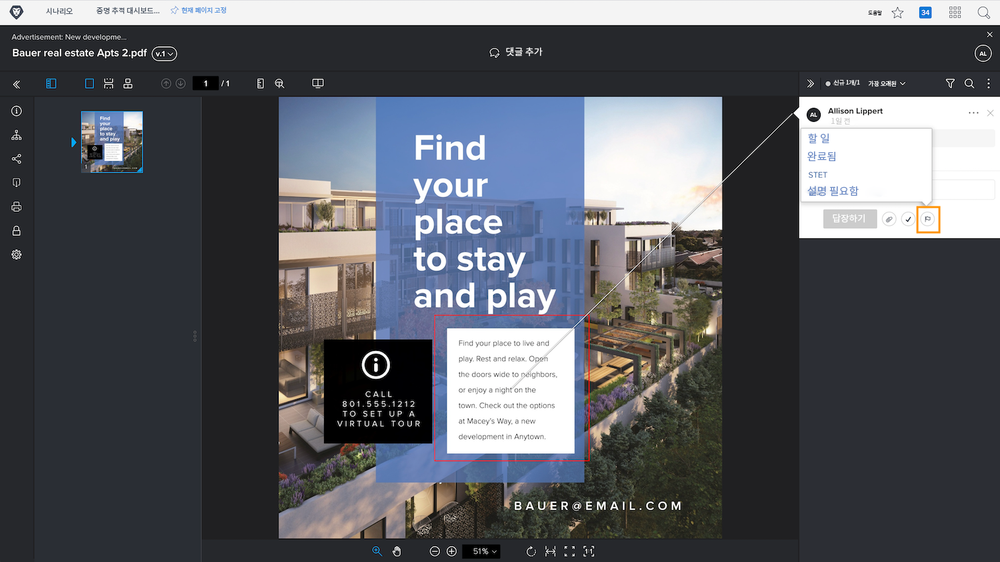
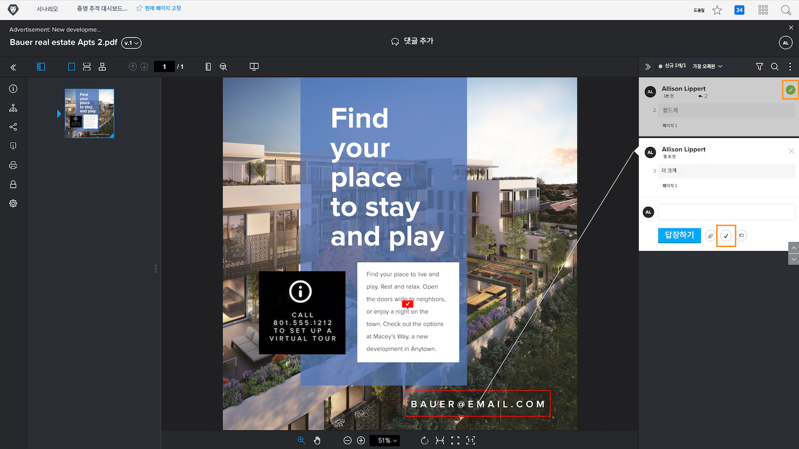

# 교정쇄 댓글 관리

[!DNL Workfront]는 댓글 작업을 사용하거나 댓글을 확인하여 자산을 수정하는 것과 같이 교정쇄에 대한 각 댓글과 관련된 작업을 추적하고 관리할 수 있습니다.

교정쇄 작업은 댓글에 대한 “플래그” 또는 “레이블”이며, 종종 댓글과 관련하여 조치가 취해졌거나 취해야 할 필요가 있음을 나타내는 데 사용됩니다. 각 댓글의 아이콘 또는 더 보기 메뉴에서 작업을 선택할 수 있습니다.

예를 들어 검토 프로세스 중에 수행된 수정 사항 중 실제로 수행해야 하는 사항을 결정해야 합니다. 작업을 사용하여 관련 댓글을 표시해서 디자이너나 편집자에게 수정 사항을 알릴 수 있습니다. 그런 다음 해당 사용자는 다른 작업을 사용하여 변경 사항이 있음을 나타낼 수 있습니다.

![댓글에 [!UICONTROL 할 일] 교정쇄 작업이 강조 표시된 교정쇄 뷰어의 교정쇄 이미지](assets/manage-comments-2.png)

댓글에 작업이 표시되지 않으면 조직에서 설정하지 않은 것입니다. 조직에서 작업을 사용해야 한다고 생각하는 경우, 교정 시스템 관리자에게 문의하십시오.

“댓글 확인” 기능은 일반적으로 댓글이 어떤 방식으로 처리되었는지(수정되었거나 질문에 답변됨) 표시하는 데 사용됩니다. 일부 [!DNL Workfront] 고객은 수정할 필요가 없거나 그냥 읽은 댓글인 경우 댓글을 “확인”합니다.

확인 표시 아이콘을 클릭하여 댓글을 확인합니다. 이렇게 하면 댓글에 녹색 확인 표시가 표시되어 댓글 열을 훑어볼 때 어떤 댓글이 검토되었는지 쉽게 확인할 수 있습니다.

이 두 가지 기능으로 댓글 열을 필터링할 수 있으므로, 교정쇄 작업을 할 때 표시되는 내용을 조정할 수 있습니다.

![[!UICONTROL 작업] 및 [!UICONTROL 일반] 필터링 옵션이 강조 표시된 교정쇄 뷰어의 댓글 필터 이미지](assets/manage-comments-3.png)

## 사용자 차례

>[!IMPORTANT]
>
>교정 워크플로에 할당된 동료에게 Workfront 교육의 일부로 교정쇄 작업을 하고 있음을 유념하십시오.

1. Workfront에 업로드한 교정쇄를 찾습니다. 교정쇄 뷰어를 열어 작성된 댓글을 보고 댓글에 답글을 달 수 있습니다. 완료되면 교정쇄 뷰어를 닫습니다.
1. 문서 세부 정보 또는 요약 패널에서 업데이트 섹션을 사용하여 Workfront에 업로드한 교정쇄에 대한 최신 댓글을 봅니다. 댓글에 답글을 답니다.

<!--
## Learn more
* Create and manage proof comments
-->
