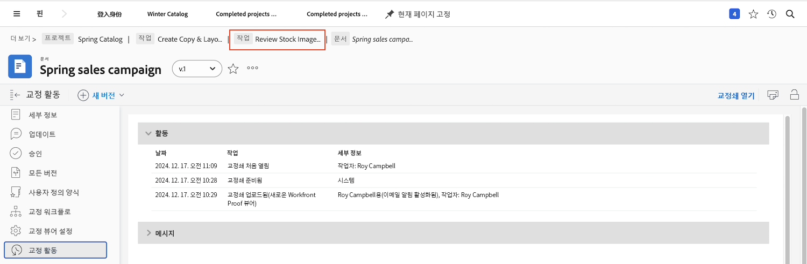

# 증명 세부 정보 이해

## 증명 세부 정보 보기

증명 관리자 또는 소유자는 요약 패널과 [!UICONTROL 문서 세부 정보] 페이지를 통해 증명을 뒷받침하는 세부 정보에 대해 더 자세히 알아볼 수 있습니다. 먼저 프로젝트, 작업 또는 문제의 [!UICONTROL 문서] 섹션에서 증명을 찾아야 합니다.

### 요약 패널

요약 패널은 증명의 기본 세부 정보에 대한 높은 수준의 개요를 제공합니다. 필요할 때 아이콘을 사용하여 패널을 확장하고 필요하지 않을 때는 축소합니다. 증명의 썸네일 위로 마우스를 가져가서 열거나 다운로드할 수도 있습니다.

![프로젝트의 [!UICONTROL 문서] 섹션에서 선택된 증명 및 확장된 요약 패널의 이미지. 요약 패널 아이콘과 요약 패널이 모두 강조 표시되어 있습니다.](assets/document-summary.png)

참고: 요약 패널의 [!UICONTROL 승인] 섹션은 **문서** 승인용이며, 이 교육 과정에서 학습 중인 증명 검토 및 승인 프로세스와는 관련이 **없습니다**. 두 프로세스는 [!DNL Workfront]에서 별개입니다.

### [!UICONTROL 문서 세부 정보]

증명에 대한 자세한 정보가 필요한 경우 [!UICONTROL 문서 세부 정보] 링크를 통해 [!DNL Workfront]에 있는 증명의 “페이지”로 이동할 수 있습니다.

![[!DNL  Workfront]에 있는 증명의 페이지의 이미지.](assets/document-details.png)

증명 프로세스와 관련된 정보를 조회할 수 있는 기능은 사용자가 [!DNL Workfront]에서 보유한 증명 권한에 따라 달라집니다.

증명의 페이지에 있는 왼쪽 패널 메뉴에서 다음 섹션에 액세스할 수 있습니다.

* **업데이트 -** 증명 뷰어에서 작성된 댓글이 “증명 댓글” 태그와 함께 여기에 표시됩니다. 작업이나 프로젝트에 댓글을 작성하듯이 파일에 댓글을 작성할 수도 있습니다(이러한 댓글은 증명 뷰어에 표시되지 않음).
* **승인 -** 이 섹션은 증명 승인이 아니라 문서 승인용입니다. 이 두 가지 유형의 승인은 [!DNL Workfront]에서 별개의 프로세스이며 서로 연관되지 않습니다. 검토 및 승인을 위해 증명 워크플로를 사용하는 경우 이 섹션은 사용하지 않습니다.
* **모든 버전 -** 증명의 버전 기록을 추적하고 관리합니다. [!UICONTROL 문서] 목록의 요약 패널에서 이 정보에 더 쉽게 액세스할 수 있습니다.
* **사용자 정의 양식 -** 사용자 정의 양식은 조직별 정보를 캡처하기 위해 증명에 사용됩니다. 이 정보는 파일과 함께 [!DNL Workfront] DAM 또는[!DNL Adobe’s] AEM과 같은 통합 문서 저장 시스템으로 전달될 수 있습니다. 사용자 정의 양식은 [!DNL Workfront] 시스템 관리자 또는 그룹 관리자가 설정합니다. 증명에 사용자 정의 양식을 사용하게 되는지 확인하려면 팀 또는 관리자에게 문의하십시오.
* **증명 워크플로 -** 증명에 할당된 워크플로를 관리하거나 수정합니다. [!UICONTROL 문서] 목록의 증명에 있는 [!UICONTROL 증명 워크플로] 링크를 사용하여 이 창을 열 수도 있습니다. 증명 워크플로 편집 비디오를 통해 워크플로를 변경하는 방법을 알아보십시오.

이제 [!UICONTROL 증명 뷰어 설정] 및 [!UICONTROL 증명 활동] 섹션을 자세히 살펴보겠습니다.

### [!UICONTROL 증명 뷰어 설정]

이 설정은 증명 자체에 대한 액세스를 제어하는 데 도움이 됩니다.

![증명의 페이지에 있는 [!UICONTROL 증명 뷰어 설정]에서 왼쪽 패널 메뉴의 [!UICONTROL 증명 뷰어 설정] 옵션이 강조 표시된 이미지.](assets/proofing-settings-on-details-page.png)

* **[!UICONTROL 로그인 필요. 이 증명은 게스트 사용자와 공유할 수 없음] -** [!DNL Workfront] 증명 라이선스가 있는 사람에게만 증명을 공유할 수 있습니다.
* **[!UICONTROL 결정 시 전자 서명 필요] -** 증명을 공유할 때 수신자에게 [!DNL Workfront]의 증명 권한이 있어야 하며, 수신자가 증명 관련 결정을 내릴 때 증명 암호를 입력하여 증명에 “전자 서명”해야 합니다. (참고: 증명 암호는 [!DNL Workfront] 암호와 다릅니다. 증명 암호는 쉽게 액세스할 수 없기 때문에 대부분의 수신자는 이 암호를 알지 못합니다.) [!DNL Workfront]에서는 이 기능을 사용하기 전에 [!DNL Workfront] 컨설턴트에게 문의할 것을 권장합니다.
* **[!UICONTROL 필요한 모든 의사결정이 내려지면 증명 잠금] -** 증명에 대한 모든 의사결정이 내려진 후에 댓글, 답변, 의사결정 등을 추가할 수 없도록 증명이 잠깁니다. 이 기능을 사용하면 증명 워크플로의 특정 단계뿐만 아니라 전체 증명 버전이 잠깁니다.
* **[!UICONTROL 원본 파일 다운로드 허용] -** 증명 수신자가 증명 뷰어에서 증명의 원본 소스 파일을 다운로드할 수 있습니다(옵션은 오른쪽 패널 메뉴에 있음).
* **[!UICONTROL 공개 URL 또는 임베드 코드를 통한 증명 공유 허용] -** 증명 수신자가 공개적으로 액세스 가능한 증명 링크를 모든 사람과 공유할 수 있습니다.
* **[!UICONTROL 공개 URL 또는 임베드 코드를 통한 증명 구독 허용] -** 공개 URL을 받은 모든 사람이 자신의 이메일 주소와 이름(증명 사용자가 아닌 경우) 또는 이메일 주소와 증명 암호(증명 사용자인 경우)를 사용하여 자신을 증명에 추가할 수 있습니다. (참고: 증명 암호는 [!DNL Workfront] 암호와 동일하지 않습니다.)

이 동일한 설정은 업로드 창 하단의 [!UICONTROL 증명 설정] 섹션에서 증명을 업로드할 때 설정할 수 있습니다.

![업로드 창 하단에 있는 [!UICONTROL 증명 설정] 섹션의 이미지.](assets/proof-settings-on-upload-page.png)

### [!UICONTROL 증명 활동]

이 페이지는 증명에서 발생한 모든 활동과 이 증명과 관련하여 전송된 이메일 메시지를 추적합니다.

![증명의 페이지에 있는 [!UICONTROL 증명 활동] 섹션에서 왼쪽 패널 메뉴의 [!UICONTROL 증명 활동] 옵션이 강조 표시된 이미지.](assets/proofing-activity-in-details.png)

[!UICONTROL 활동] 섹션은 댓글 및 의사결정이 추가된 시점과 이를 추가한 사람을 기록합니다. 또한 증명 워크플로 단계가 시작된 시점, 수신자가 처음으로 증명을 연 시점, 증명 관리자 또는 소유자가 확인하고자 하는 기타 정보를 추적합니다. 이러한 세부 정보는 예를 들어 증명 워크플로 단계가 시작되지 않은 이유와 같은 내용을 파악하려고 할 때 도움이 될 수 있습니다.

[!UICONTROL 메시지] 섹션은 이메일 알림 및 메시지가 수신자에게 전송된 시점, 보낸 사람 및 메시지 내용을 기록합니다. 증명에 대한 이메일을 받지 못한 사람이 있는 경우와 같은 문제를 해결할 때 유용할 수 있습니다. 이메일이 전송되었는지 여부와 전송된 시간을 확인할 수 있습니다.

[!DNL Workfront]에서는 증명 관리자와 증명 소유자가 이 두 섹션의 정보를 숙지할 것을 권장합니다. 이 정보를 파악하고 [!UICONTROL SOCD] 진행률 표시줄을 해석하는 방법을 이해하면 증명 워크플로의 어느 지점에 있든 상관없이 증명을 제대로 이해하고 관리할 수 있습니다.

[!UICONTROL 문서 세부 정보] 섹션의 작업을 완료했으면 이동 경로를 사용하여 증명이 첨부된 프로젝트, 작업 또는 문제의 [!UICONTROL 문서] 섹션으로 돌아갑니다.

<!--
#### Learn more
* [!UICONTROL Document details] overview
* Add a custom form to a document
* Request document approvals
* Summary for documents overview
* View activity on a proof within [!DNL Workfront]
-->
