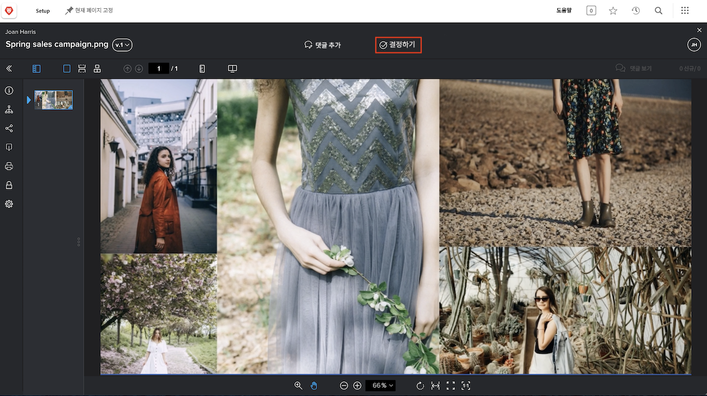
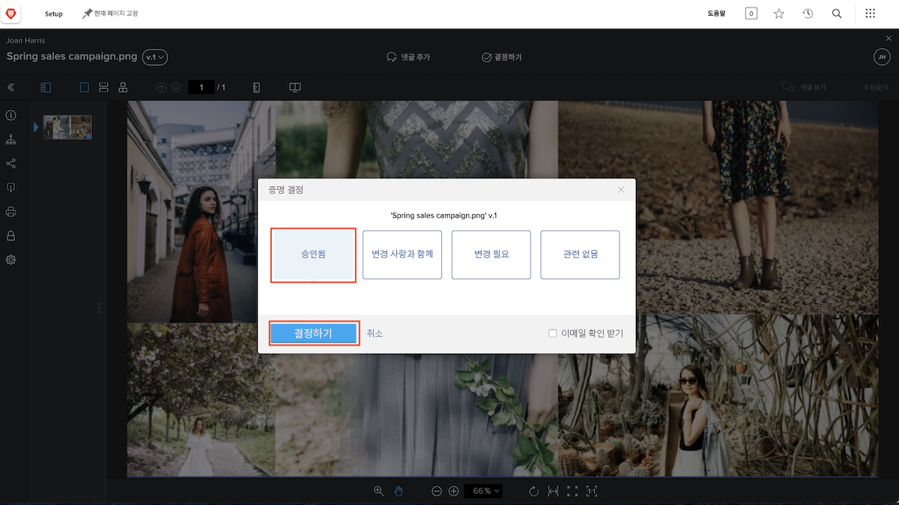

# 교정쇄 검토 및 승인

교정쇄 검토를 시작하기 전에 자신에게 기대되는 바를 파악하고 있도록 합니다. 교정 워크플로에서 귀하의 역할은 무엇입니까? 교정쇄를 검토 또는 승인하거나 둘 다 하시겠습니까?

교열 편집자로서 문법 오류 및 맞춤법 오류에 대한 교정쇄를 검토하는 것에 중점을 둘 수 있습니다. 마케팅 및 크리에이티브 팀은 자산 디자인에 집중하고 기업 브랜딩을 준수하는지 확인할 수 있습니다. 법무팀은 서비스 계약의 문구가 완벽하도록 보장할 수 있습니다. 또한 프로젝트 관리자는 검토 중인 콘텐츠가 관련된 프로젝트의 의도와 목표를 충족하는지 확인할 수 있습니다.

교정쇄를 승인하라는 요청을 받을 수도 있습니다. 교정쇄를 승인하는 작업은 “이 작업은 괜찮고 시작할 준비가 되었습니다”라는 의미입니다. “이 작업을 변경해야 합니다. 수정을 위해 다시 보내 주세요”라는 의미일 수도 있습니다.

예상되는 내용을 알게 되면 교정쇄 검토를 시작할 수 있습니다.

## 검토할 교정쇄 받기

자산을 검토하고 승인할 준비가 되면 이메일 알림을 받게 됩니다.

![[!DNL  Workfront]에서 두 가지 교정쇄의 검토 및 승인을 요청하는 새로운 교정쇄 이메일의 이미지](assets/new-proof-emails.png)

이 교정쇄 링크는 사용자 고유의 것임에 유의하는 것이 중요합니다. 다른 사람과 링크를 공유하면 그들이 하는 모든 댓글과 마크업에 내 이름이 태그됩니다.

[!UICONTROL 새 교정쇄] 이메일에는 교정쇄에 대한 다음과 같은 필수 정보도 포함되어 있습니다.

* 교정쇄 이름은 이메일의 제목입니다.
* 썸네일을 통해 검토할 항목을 빠르게 확인할 수 있습니다.
* 버전 번호를 통해 보고 있는 교정쇄 버전을 알 수 있습니다.
* 가장 중요한 것은 기한이 이메일의 두 위치(교정쇄 세부 정보 섹션의 바로 위 및 사용자가 속한 워크플로 단계의 회색 막대)에 표시된다는 것입니다.

검토를 시작할 준비가 되면 파란색 [!UICONTROL 교정쇄로 이동] 버튼을 클릭하기만 하면 파일이 자동으로 [!DNL Workfront] 교정쇄 뷰어에서 열립니다.

### [!UICONTROL 홈]에서 교정쇄 열기

[!DNL Workfront]에서 작업하는 동안 교정쇄를 승인해 달라는 요청을 받은 경우, [!DNL Workfront] [!UICONTROL 홈]의 [!UICONTROL 내 승인] 위젯에서 할당을 찾을 수 있습니다.

![[!DNL Workfront] [!UICONTROL 홈]의 [!UICONTROL 내 승인] 위젯 이미지.](assets/open-proof-from-home.png)

승인하도록 할당된 경우에만 [!DNL Workfront] [!UICONTROL 홈]에 교정쇄가 표시된다는 점에 유의해야 합니다. 교정본만 검토해 달라는 요청을 받은 경우에는 [!DNL Workfront] [!UICONTROL 홈]에 표시되지 않습니다.

[!UICONTROL 교정쇄로 이동] 링크를 클릭하여 교정쇄 뷰어에서 이를 여십시오.

조직의 교정쇄 및 프로젝트 워크플로에 따라 교정쇄 승인 요청 대신 [!DNL Workfront] [!UICONTROL 홈]에서 작업 할당을 볼 수 있습니다. 이 경우 작업 자체의 [!UICONTROL 문서] 섹션에서 교정쇄를 엽니다(자세한 내용은 아래 참조).

또한 교정 워크플로 관리에 도움이 되도록 팀 또는 조직을 위해 특별히 생성된 [!DNL Workfront] 대시보드에서 검토할 교정쇄를 찾을 수도 있습니다.

### 프로젝트, 작업 또는 문제에서 교정쇄 열기

주로 [!DNL Workfront]에서 프로젝트, 작업 또는 문제로 작업하는 경우, 해당 항목의 [!DNL Documents] 섹션에서 바로 교정쇄를 여는 것을 선호할 수 있습니다.

![[!UICONTROL 교정쇄 열기] 링크가 강조 표시된 [!DNL  Workfront] 작업에서 발견된 [!UICONTROL 문서] 섹션의 이미지](assets/open-proof-from-documents.png)

1. 프로젝트, 작업 또는 문제의 이름을 클릭합니다.
2. 항목 페이지의 왼쪽 패널 메뉴에서 [!UICONTROL 문서]를 클릭합니다.
3. [!UICONTROL 문서] 목록에서 교정쇄를 찾습니다.
4. [!UICONTROL 교정쇄 열기] 링크를 클릭하여 교정쇄 뷰어를 엽니다.

## 교정쇄를 승인하는 방법

교정쇄를 열면 상단의 **댓글 추가** 옆에 **결정하기** 버튼이 표시됩니다. 본인이 이 교정쇄의 승인자가 아닌 경우 이 버튼이 표시되지 않습니다.

결정을 내릴 준비가 되면 **결정하기** 버튼을 클릭하여 결정 옵션을 확인합니다. 원하는 항목을 선택한 다음 아래의 다른 **결정하기** 버튼을 클릭합니다.

## 교정쇄 검토 및 승인

이 비디오에서는 다음 방법을 배우게 됩니다.

* 교정쇄를 검토할 때 자신에게 기대되는 바를 파악하기
* 교정쇄에 댓글 달기
* 마크업을 사용하여 교정쇄에 필요한 변경 사항 표시
* 교정쇄 댓글에 답글 달기
* 교정쇄 승인 또는 거부

>[!VIDEO](https://video.tv.adobe.com/v/335141/?quality=12&learn=on&enablevpops)

<!--
#### Learn more
* Create and manage proof comments
* Make decisions on a proof
* Review a static proof
* Tag users to share a proof
* Notifications for proof comments and decisions
-->

<!--
#### Guides
* Reviewing proofs in [!DNL Workfront]
* -->
