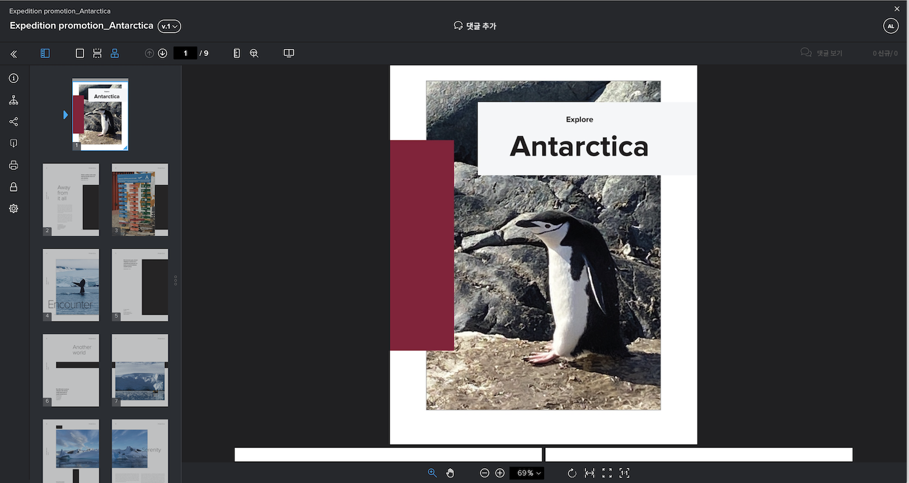

# 여러 파일을 하나의 증명으로 결합

여러 파일을 하나의 증명으로 결합하면 증명 프로세스가 보다 간소화되는 경우가 많습니다.

&quot;결합&quot; 옵션은 개별 파일이 관련되거나 전체 결과물의 일부이고 모든 파일을 동일한 기한까지 동일한 사람이 검토해야 할 때 유용합니다.

예를 들어, 크리에이티브 팀은 책자를 디자인했습니다. 4명의 디자이너가 페이지를 제작하여 개별 PDF으로 저장했습니다. 각 디자이너가 개별 증명으로 업로드한 경우 검토자는 검토할 4개의 개별 증명을 갖게 됩니다. 게다가, 책자의 조각들이 서로 잘 맞는지 확인하는 것은 더 어려울 것이다.

해결 방법 - 한 사람이 모든 PDF을 업로드하고 이를 하나의 증명으로 결합하여 업로드하도록 합니다. 이를 통해 검토자는 연결이 끊어진 부분 대신 전체적으로 소책자를 볼 수 있습니다.

증명을 결합하려면 다음을 수행하십시오.

1. 를 엽니다. [!UICONTROL 문서] 증명을 첨부해야 하는 프로젝트, 작업 또는 문제의 섹션.
2. 파일을 업로드 영역으로 끌어다 놓거나 찾습니다. [!DNL Workfront] 는 최대 50개의 파일을 결합할 수 있습니다.
3. 에 대한 옵션 켜기/끄기 [!UICONTROL 호환되는 모든 파일을 단일 증명으로 결합].
4. 결합된 증명의 이름을 입력합니다. 필수 항목입니다.
5. 원하는 경우 업로드 목록에서 파일을 드래그하여 놓는 순서를 변경할 수 있습니다.
6. 증명 수신자 추가, 기한 설정 등
7. 클릭 [!UICONTROL 증명 만들기] 업로드를 완료합니다.

![의 이미지 [!UICONTROL 새 증명] 업로드된 파일 목록 및 [!UICONTROL 단일 증명] 강조 표시된 섹션입니다.](assets/combine-proofs.png)

증명이 업로드되면 다음에서 ZIP 파일로 표시됩니다. [!UICONTROL 문서] 탭.

결합된 파일을 보는 데는 다른 작업이 필요하지 않습니다. 그냥 클릭 [!UICONTROL 증명 열기] 평소처럼 증명이 증명 뷰어로 열립니다.

## 당신 차례입니다

>[!IMPORTANT]
>
>Workfront 교육의 일부로 증명을 보내는 동료에게 잊지 말고 상기시키십시오.

3개 또는 4개의 파일(PDF, 텍스트 파일 등) 찾기 컴퓨터에서.

1. Workfront에서 실습에 사용하는 프로젝트, 작업 또는 문제를 엽니다.
1. 파일을 업로드하여 하나의 증명으로 결합합니다.
1. 목록의 마지막 파일을 목록의 첫 번째 파일로 이동하여 파일 순서를 조정합니다.
1. 원하는 워크플로(기본 또는 자동)를 할당하고 업로드를 완료합니다.

<!--
##Learn more
* Create a multi-page proof
-->
