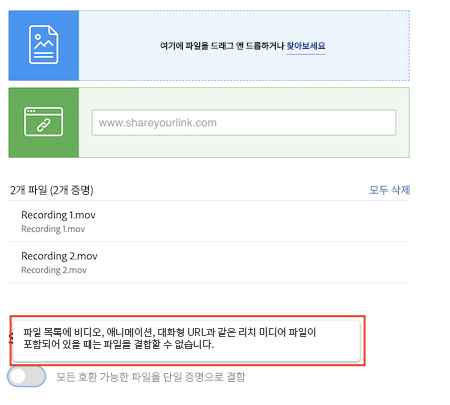

# 여러 파일을 하나의 증명으로 결합

여러 파일을 하나의 증명으로 결합하면 종종 증명 프로세스가 더 간소화될 수 있습니다.

“결합” 옵션은 개별 파일이 관련되어 있거나 전체 결과물의 일부이고 동일한 기한까지 동일한 사람이 모든 파일을 검토해야 하는 경우에 유용합니다.

예를 들어 크리에이티브 팀은 소책자를 디자인했습니다. 네 명의 디자이너가 페이지를 제작하여 개별 PDF로 저장했습니다. 각 디자이너가 이를 개별 증명으로 업로드한 경우, 검토자는 검토할 네 개의 개별 증명을 갖게 됩니다. 또한 소책자 부분이 서로 잘 맞는지 확인하는 것이 더 어려울 것입니다.

솔루션 - 한 사람이 모든 PDF를 업로드하고 업로드 시 하나의 증명으로 결합합니다. 이를 통해 검토자는 소책자를 분리된 부분이 아닌 전체적으로 볼 수 있습니다.

증명을 결합하는 방법:

1. 증명을 첨부해야 하는 프로젝트, 작업 또는 문제의 [!UICONTROL 문서] 섹션을 엽니다.
2. 파일을 업로드 영역으로 끌어서 놓거나 파일을 찾습니다. [!DNL Workfront]는 최대 50개의 파일 결합을 지원합니다.
3. [!UICONTROL 호환되는 모든 파일을 하나의 증명으로 결합] 옵션을 토글합니다.
4. 결합된 증명의 이름을 입력합니다. 이는 필수입니다.
5. 원하는 경우, 업로드 목록에서 끌어서 놓아 파일이 결합되는 순서를 변경할 수 있습니다.
6. 증명 수신자를 추가하고 기한을 설정하는 작업 등입니다.
7. [!UICONTROL 증명 만들기]를 클릭하여 업로드를 완료합니다.

![업로드된 파일 목록 및 [!UICONTROL 단일 증명] 섹션이 강조 표시된 [!UICONTROL 새 증명] 창의 이미지](assets/combine-proofs.png)

증명이 업로드되면 [!UICONTROL 문서] 탭에 ZIP 파일로 표시됩니다.

결합된 파일을 보는 데 다른 것은 필요하지 않습니다. 평소처럼 [!UICONTROL 증명 열기]를 클릭하면 증명 뷰어에 증명이 열립니다.

## 비디오 파일도 결합할 수 있습니까?

죄송합니다. 목록에 비디오, 애니메이션, 대화형 URL 등의 리치 미디어 파일이 있으면 파일을 결합할 수 없습니다.

## 사용자 차례

>[!IMPORTANT]
>
>Workfront 교육의 일부로 증명을 보낸다는 사실을 동료에게 알려 주시기 바랍니다.

컴퓨터에서 세 개 또는 네 개의 파일(PDF, 텍스트 파일 등)을 찾습니다.

1. Workfront에서 실습 연습을 위해 사용 중인 프로젝트, 작업 또는 문제를 엽니다.
1. 파일을 업로드하여 단일 증명으로 결합합니다.
1. 목록의 마지막 파일을 목록의 첫 번째 파일로 이동하여 파일 순서를 조정합니다.
1. 선택한 워크플로(기본 또는 자동)를 할당하고 업로드를 완료합니다.

<!--
##Learn more
* Create a multi-page proof
-->
