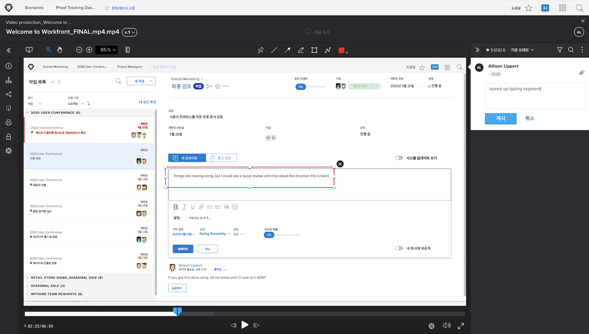

# 비디오 증명 업로드

[!DNL Workfront’s] 증명 기능은 PDF, 스프레드시트 또는 이미지와 같은 정적 파일에만 사용할 수 없습니다. [!DNL Workfront] 는 최대 4GB 크기의 비디오 및 웹 캡처를 포함하여 150개 이상의 파일 유형을 지원합니다.

큰 파일을 업로드하는 데 시간이 더 오래 걸린다는 점을 기억하십시오. 대규모 업로드를 시작하기 전에 인터넷 연결이 안정적인지 확인하십시오. 업로드 프로세스가 중단될 수 있기 때문입니다.

<!-- For a complete list of uploadable file types, see the article, Supported proofing file types. -->

[!DNL Workfront’s] 증명 뷰어는 비디오 파일을 검토하고 승인하는 데 이상적인 장소입니다. 증명 수신자는 증명 뷰어에서 비디오를 바로 재생할 수 있습니다. 댓글은 타임스탬프가 지정되므로 댓글이 비디오의 어느 부분을 참조하는지 정확히 알 수 있습니다. 증명 수신자는 마크업 도구를 사용하여 일시 중지된 비디오에 바로 그릴 수도 있습니다.

지원되는 비디오 유형에는 MOV, MP4 및 H.264가 있습니다. <!-- Check the supported file types list to make sure the video type you use is compatible with Workfront’s proofing features.-->

에서 비디오 업로드 [!DNL Workfront] 정적 파일을 업로드하는 것과 동일한 단계를 따릅니다.

* 비디오를 업로드해야 하는 프로젝트, 작업 또는 문제를 엽니다.
* 선택 [!UICONTROL **문서**] 왼쪽 패널 메뉴에서
* 다음에서 [!UICONTROL **새로 추가**]&#x200B;단추, 선택 [!UICONTROL **증명**].
* 비디오 파일을 업로드 영역으로 끌어다 놓거나 찾아보기 기능을 사용하십시오.
* 기본 또는 자동화된 워크플로를 할당합니다.
* 기한을 설정하십시오.
* 클릭 [!UICONTROL **증명 만들기**] 끝내려고.

## 당신 차례입니다

>[!IMPORTANT]
>
>Workfront 교육의 일부로 증명을 보내는 동료에게 알림을 잊지 마십시오.

사용 가능한 비디오 파일이 있는 경우 Workfront의 실습 프로젝트, 작업 또는 문제에 업로드하십시오. 일반적으로 사용할 워크플로와 유사한 기본 또는 자동화된 워크플로를 적용하거나, 해당 워크플로가 무엇인지 이미 알고 있는 경우 실제 워크플로를 적용합니다.

