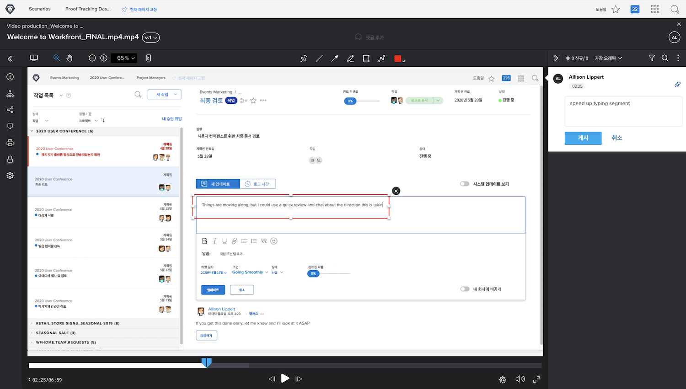

# 비디오 교정쇄 업로드

[!DNL Workfront’s] 교정 기능은 PDF, 스프레드시트 또는 이미지와 같은 정적 파일만을 위한 것이 아닙니다. [!DNL Workfront]는 최대 4GB 크기의 비디오 및 웹 캡처를 포함하여 150여 개의 파일 형식을 지원합니다.

큰 파일은 업로드하는 데 시간이 더 오래 걸린다는 점을 기억하십시오. 중단으로 인해 업로드 프로세스가 종료될 수 있으므로 대용량 업로드를 시작하기 전에 인터넷 연결이 안정적인지 확인하십시오.

<!-- For a complete list of uploadable file types, see the article, Supported proofing file types. -->

[!DNL Workfront’s] 교정쇄 뷰어는 비디오 파일을 검토하고 승인하기에 이상적입니다. 교정쇄 수신자는 교정쇄 뷰어에서 바로 비디오를 재생할 수 있습니다. 댓글에는 타임스탬프가 표시되므로 비디오에서 댓글이 언급되는 부분을 정확히 알 수 있습니다. 교정쇄 수신자는 마크업 도구를 사용하여 일시 중지된 비디오에 직접 그릴 수도 있습니다.

지원되는 비디오 유형에는 MOV, MP4 및 H.264가 있습니다. <!-- Check the supported file types list to make sure the video type you use is compatible with Workfront’s proofing features.-->

[!DNL Workfront]에서 비디오를 업로드하는 것은 정적 파일을 업로드하는 것과 같은 단계를 따릅니다.

* 비디오를 업로드해야 하는 프로젝트, 작업 또는 문제를 엽니다.
* 왼쪽 패널 메뉴에서 [!UICONTROL **문서**]&#x200B;를 선택합니다.
* [!UICONTROL **새로 만들기 추가**]&#x200B;버튼에서 [!UICONTROL **교정쇄**]&#x200B;를 선택합니다.
* 비디오 파일을 업로드 영역으로 끌어서 놓거나 찾아보기 기능을 사용합니다.
* 기본 또는 자동화된 워크플로를 할당합니다.
* 기한을 정합니다.
* [!UICONTROL **교정쇄 만들기**]&#x200B;를 클릭하여 완료합니다.

## 사용자 차례

>[!IMPORTANT]
>
>Workfront 교육의 일부로 교정쇄를 보낸다는 사실을 동료에게 경고로 알려 주시기 바랍니다.

사용 가능한 비디오 파일이 있는 경우에 Workfront의 실습 프로젝트, 작업 또는 문제에 업로드합니다. 일반적으로 사용하는 것과 유사한 기본 또는 자동화된 워크플로를 적용하거나 이미 알고 있는 경우 실제 워크플로를 적용합니다.

