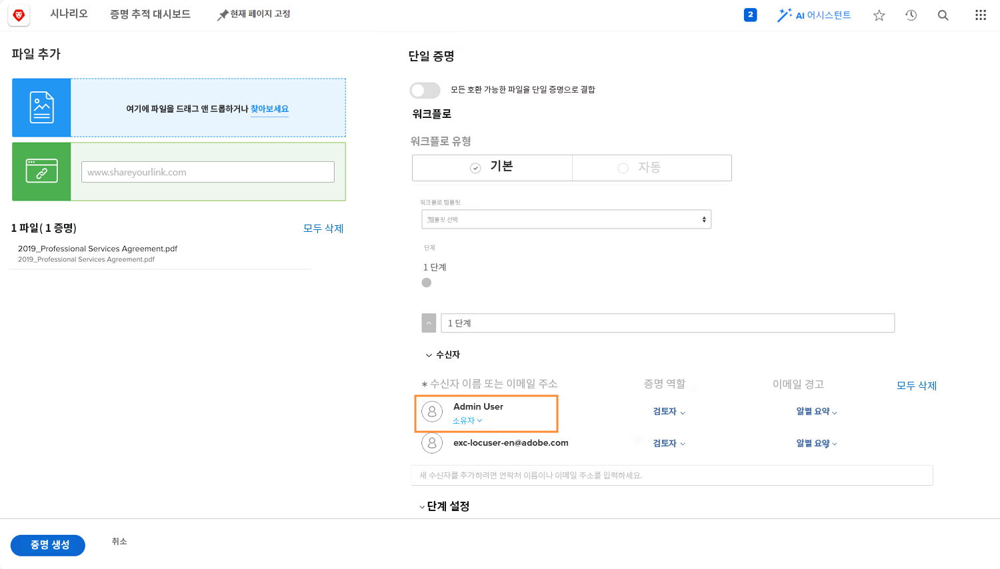

# 자동화된 워크플로로 교정쇄 업로드

이 비디오를 통해 다음과 같은 사항을 알아볼 수 있습니다.

* 자동화된 교정 워크플로를 사용할 수 있는 경우
* 교정 템플릿을 사용하여 워크플로를 적용하는 방법
* 처음부터 자동화된 워크플로를 설정하는 방법

>[!VIDEO](https://video.tv.adobe.com/v/335133/?quality=12&learn=on&enablevpops=1)

## 추가 교정 워크플로 설정

교정쇄 업로드 창 하단의 설정은 옵션이므로 사용 여부와 방법을 조직에 확인하십시오.

![[!UICONTROL 단계 설정]이 강조 표시된 [!UICONTROL 새 교정쇄] 창의 이미지](assets/additional-proof-workflow-settings.png)

* **[!UICONTROL 잠금 단계] -** 워크플로 단계의 사용자가 워크플로 단계가 완료된 후 댓글을 달거나 결정을 변경할 수 없습니다.
* **[!UICONTROL 기본 결정 권한 전송] -** 기본 의사 결정권자를 지정하여 교정 프로세스의 속도를 높입니다. 설정하면 [!DNL Workfront]는 이 사용자의 교정 결정을 해당 결정으로 인식합니다. 해당 사용자가 결정을 내리면 단계는 종료되며 다른 결정은 필요하지 않습니다.
* **[!UICONTROL 이 단계에 한 가지 단계만 필요] -** 교정 프로세스를 간소화하는 또 다른 방법은 교정쇄에 대한 한 가지 결정만 요구하는 것입니다. 이 기능을 켜면 해당 단계에 얼마나 많은 승인자가 있든 상관없이 결정이 내려지면 해당 단계가 완료됩니다.
* **[!UICONTROL 이 단계를 비공개로 설정] -** 기본적으로 교정쇄에 대한 댓글은 모든 단계에서 모든 사용자가 볼 수 있습니다. 확인란을 클릭하여 다른 단계의 교정쇄 수신자가 이 단계에서 작성된 댓글을 볼 수 없도록 합니다.

교정쇄 업로드 창 하단에는 교정쇄를 보기 위해 로그인을 요구하는 것과 같이 교정쇄 보안에 영향을 미치는 몇 가지 교정쇄 설정이 있습니다.

<!--
Learn more about these in the Proof settings section of the Configure a proof article.
-->

![교정쇄 업로드 창의 [!UICONTROL 교정쇄 설정] 섹션 이미지](assets/additional-proof-workflow-settings-2.png)

<!--
### Learn more
* Automated workflow overview
* Automated workflow stages overview
-->

<!--
### Guides
* Plan an advanced workflow worksheet
-->

## 교정 워크플로에 있는 이유는 무엇입니까?

교정쇄를 업로드하는 사람이기 때문에 교정쇄 수신자 목록에 있다는 것을 알게 될 것입니다. 또한 귀하를 교정쇄 소유자로 만들어 교정쇄에 대한 편집 권한을 부여하여 워크플로 설정을 변경하거나 새 버전을 업로드할 수 있도록 합니다.

교정쇄만 업로드하고 다른 사용자가 워크플로를 관리할 경우, [!UICONTROL 소유자] 링크를 클릭하고 이름을 입력하여 교정쇄 소유자를 변경할 수 있습니다. 원래 업로더가 아닌 다른 사람이 버전을 업로드할 경우 권장됩니다.

## 사용자 차례

>[!IMPORTANT]
>
>Workfront 교육의 일부로 교정쇄를 보낸다는 사실을 동료에게 알려 주시기 바랍니다.

고급 워크플로로 교정쇄를 업로드합니다. 조직에 이미 교정 템플릿이 설정되어 있는 경우, 팀에서 사용하는 템플릿을 선택한 다음 몇 가지를 조정합니다.

* 교정쇄에서 활동이 발생할 때 아무도 알림을 받지 않도록 이메일 알림을 조정합니다.
* 첫 번째 단계에는 2명의 검토자/승인자가 있어야 합니다.
* 두 번째 단계에는 검토자/승인자가 1명만 있어야 합니다.

조직에 아직 생성된 교정 템플릿이 없는 경우, 처음부터 2단계 워크플로를 설정합니다.

* 자신과 좋아하는 동료를 첫 번째 단계에 할당합니다.
* 교정쇄가 생성된 날로부터 1일을 1단계 기한으로 설정합니다.
* 다른 좋아하는 동료를 두 번째 단계에 할당합니다.
* 첫 번째 단계의 기한이 지나면 단계가 시작되도록 합니다.
* 이 단계에 있는 사람에게 검토를 완료하는 데 2일의 시간을 주지만 정오까지 완료해야 합니다.

